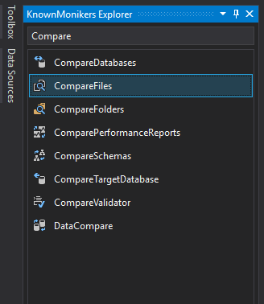
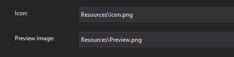

# 5. Gün Çalışma Notları


## VSIX için kod düzeltildi

- `ThreadHelper.ThrowIfNotOnUIThread();` ile eklenti işlevlerinin main thread üzerinden olduğundan emin olmalıyız
- Async metotlar için yukarıdaki kontorl `await ThreadHelper.JoinableTaskFactory.SwitchToMainThreadAsync();` ile yapılır
- Tek dosya seçildiğinde ikinci dosyayı dialog ekranından alacak

```c#
[System.Diagnostics.CodeAnalysis.SuppressMessage("Usage", "VSTHRD100:Avoid async void methods", Justification = "<Pending>")]
private async void Execute(object sender, EventArgs e)
{
    var dte = await ServiceProvider.GetServiceAsync(typeof(DTE)).ConfigureAwait(false) as DTE2 ?? throw new NullReferenceException("DTE alınamadı");
    string file1, file2;

    await ThreadHelper.JoinableTaskFactory.SwitchToMainThreadAsync();
    if (CanFilesBeCompared(dte, out file1, out file2))
    {
        dte.ExecuteCommand("Tools.DiffFiles", $"\"{file1}\" \"{file2}\"");
    }
}

/// <summary>
/// 2 dosyanın kıyaslanabilir olup olmadağını kontrol eder
/// </summary>
/// <param name="dte"></param>
/// <param name="file1"></param>
/// <param name="file2"></param>
/// <returns></returns>
public static bool CanFilesBeCompared(DTE2 dte, out string file1, out string file2)
{
    ThreadHelper.ThrowIfNotOnUIThread();
    var items = GetSelectedFiles(dte);
    file1 = items.ElementAtOrDefault(0);
    file2 = items.ElementAtOrDefault(1);

    if (items.Count() == 1)
    {
        var dialog = new OpenFileDialog
        {
            InitialDirectory = Path.GetDirectoryName(file1)
        };
        dialog.ShowDialog();

        file2 = dialog.FileName;
    }

    return !string.IsNullOrEmpty(file1) && !string.IsNullOrEmpty(file2);
}

/// <summary>
/// Dosya yollarının bilgilerini verir
/// </summary>
/// <param name="dte">VS için otomasyon objesi</param>
/// <returns></returns>
public static IEnumerable<string> GetSelectedFiles(DTE2 dte)
{
    ThreadHelper.ThrowIfNotOnUIThread();
    var items = (Array)dte.ToolWindows.SolutionExplorer.SelectedItems;
    return from item in items.Cast<UIHierarchyItem>()
            let pi = item.Object as ProjectItem
            select pi.FileNames[1];
}
}
```
## VSIX için ikon ekleme



- PNG dışındaki formatları da destekler ama PNG kullan
- VSIX'de 3000 icon vardır bunları kullanabilmek için [Extensibility Essentials 2019](https://marketplace.visualstudio.com/items?itemName=MadsKristensen.ExtensibilityEssentials2019) eklentisini indir
- View -> Other Windows -> KnownMoniker
- Çıkan panelde seçilen ikonu Resource içerisine alttak özelliklerle eklemeliyiz:
  - `16 width` ile  `*Command.png` icon dosyasını overwrite ederek
  - `175 width` ile `Preview` isimle
  - `90 width` ile `Icon` isimle
- `*.vsct` dosyası içerisinde **silmen gereken** kısımlar
  -  `Bitmap` alanında `usedList` kısmındaki değerlerden ilki hariç diğerlerini
  -  `GuidSymbol` alanındaki `IDSymbol` satırlarından ilki hariç diğerlerini


- Son eklenen resimleri projeye dahil etmek için `Solution Explorer` alanında  sağdan 3. ikon `Show all files` ile resimleri bulup, onları seçip `Include From Project` demeliyiz

- ``*.vsixmanifest` dosyasına ikon ve ön izleme resmi eklenmeli

