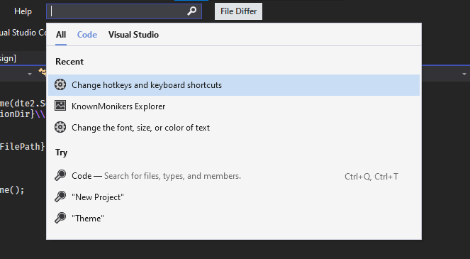
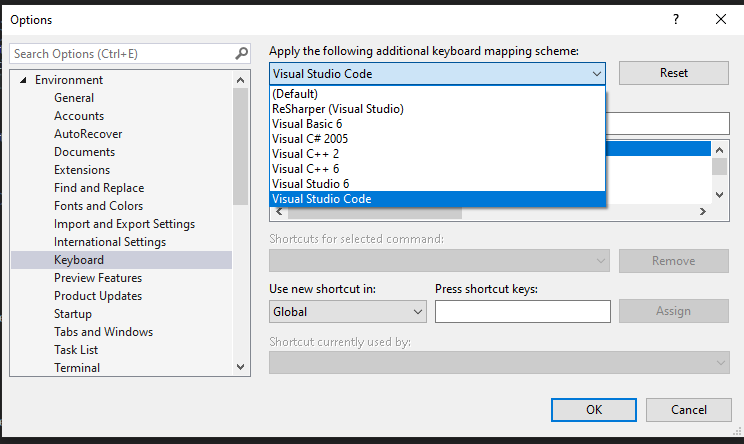

# 8. Gün Notları

## İş Sağlığı Güvenliği Kursu Tamamlandı

3 dersin sertifikası da 100 puan ile alındı

## VS için Visual Studio Code Shortcutları Ayarlandı




## VSIX ile Editör Satırını ve Methodunu Alma

```c#
var dte = await ServiceProvider.GetServiceAsync(typeof(DTE)).ConfigureAwait(false) as DTE2 ?? throw new NullReferenceException("DTE alınamadı");

EnvDTE.TextSelection ts = dte.ActiveWindow.Selection as EnvDTE.TextSelection;
if (ts == null)
    return;
EnvDTE.CodeFunction func = ts.ActivePoint.CodeElement[vsCMElement.vsCMElementFunction]
            as EnvDTE.CodeFunction;
if (func == null)
    return;

string message = dte.ActiveWindow.Document.FullName + System.Environment.NewLine +
    "Line " + ts.CurrentLine + System.Environment.NewLine +
    func.FullName;
// ts.CurrentLine  69
// func.FullName   TestForm.Form1.InitializeComponent
// "C:\\Users\\PC_1543\\source\\repos\\TestForm\\TestForm\\Form1.Designer.cs\r\nLine 69\r\nTestForm.Form1.InitializeComponent"
```

> - [Visual Studio Extension: How to get the line on which Context Menu was called?](https://stackoverflow.com/a/46067206)

## VSIX ile Seçili Sıralama

```c#
var dte = await ServiceProvider.GetServiceAsync(typeof(DTE)).ConfigureAwait(false) as DTE2 ?? throw new NullReferenceException("DTE alınamadı");
EnvDTE.TextSelection ts = dte.ActiveWindow.Selection as EnvDTE.TextSelection;
if (ts == null)
    return;

string[] selectedLines = ts.Text.Split('\n');
selectedLines = selectedLines.OrderBy(p => p).ToArray();
ts.Text = string.Join("\n", selectedLines);
```
> - [How to get selected text of visual studio 2015 editor windows?](https://stackoverflow.com/a/40508224)
> - [Read a text file and sort in C#](https://gist.github.com/Ellyll/7716439)

## VSIX ile Method İçeriğini Sıralama

```c#
var dte = await ServiceProvider.GetServiceAsync(typeof(DTE)).ConfigureAwait(false) as DTE2 ?? throw new NullReferenceException("DTE alınamadı");

EnvDTE.TextSelection ts = dte.ActiveWindow.Selection as EnvDTE.TextSelection;
if (ts == null)
    return;
EnvDTE.CodeFunction func = ts.ActivePoint.CodeElement[vsCMElement.vsCMElementFunction] as EnvDTE.CodeFunction;
if (func == null)
    return;

// Func içerğini al -> sırala -> güncelle
string selectedCodeText = func.GetStartPoint(vsCMPart.vsCMPartBody).CreateEditPoint().GetText(func.EndPoint);
selectedCodeText = string.Join("\n", selectedCodeText.Split('\n').OrderBy(p => p));
func.GetStartPoint(vsCMPart.vsCMPartBody).CreateEditPoint().ReplaceText(func.EndPoint, selectedCodeText, (int) vsEPReplaceTextOptions.vsEPReplaceTextAutoformat);
```

> - [vs2010 automation : Get the text value of a EnvDTE.CodeElement](https://stackoverflow.com/a/21463351)
> - [Get function body programatically using Automation](https://social.msdn.microsoft.com/Forums/en-US/542a3756-6d6e-4744-a035-fc7238203857/get-function-body-programatically-using-automation?forum=vsxs)


## Yorum Satırlarını Kaldırma

```c#
static string StripComments(string code)
{
    var re = @"(@(?:""[^""]*"")+|""(?:[^""\n\\]+|\\.)*""|'(?:[^'\n\\]+|\\.)*')|//.*|/\*(?s:.*?)\*/";
    return Regex.Replace(code, re, "$1");
}
```

## VSIX Aktif Dokümandaki Üretilen Kodları Sıralama

```c#
static void SortGeneratedCode(DTE2 dte)
{
    ThreadHelper.ThrowIfNotOnUIThread();
    // Aktif dokümanın içeriğini alma
    FileCodeModel fcm = dte.ActiveDocument.ProjectItem.FileCodeModel;
    foreach (CodeElement element in fcm.CodeElements)
    {
        if (element is CodeNamespace)
        {
            CodeNamespace nsp = element as CodeNamespace;

            foreach (CodeElement subElement in nsp.Children)
            {
                if (subElement is CodeClass)
                {
                    CodeClass c2 = subElement as CodeClass;
                    foreach (CodeElement item in c2.Children)
                    {
                        if (item is CodeFunction)
                        {
                            CodeFunction cf = item as CodeFunction;
                            if (cf.Name == "InitializeComponent")
                            {
                                string generatedCode = cf.GetStartPoint(vsCMPart.vsCMPartBody).CreateEditPoint().GetText(cf.EndPoint);
                                generatedCode = StripComments(generatedCode);
                                generatedCode = string.Join("\n", generatedCode.Split('\n').OrderBy(p => p)).Trim();
                                cf.GetStartPoint(vsCMPart.vsCMPartBody).CreateEditPoint().ReplaceText(cf.EndPoint, generatedCode, (int)vsEPReplaceTextOptions.vsEPReplaceTextAutoformat);
                            }
                        }
                    }
                }
            }
        }
    }
}
```

> [Get current source file methods in Visual Studio Text Editor Extension](https://stackoverflow.com/a/45181583)

## Temizlenen Kodlar

```c#
private async Task<TextViewSelection> GetTextSelectionAsync(Microsoft.VisualStudio.Shell.IAsyncServiceProvider serviceProvider)
{
    var service = await serviceProvider.GetServiceAsync(typeof(SVsTextManager)).ConfigureAwait(false);
    var textManager = service as IVsTextManager2;

    textManager.GetActiveView2(1, null, (uint)_VIEWFRAMETYPE.vftCodeWindow, out IVsTextView view);
    view.GetSelection(out int startLine, out int startColumn, out int endLine, out int endColumn);
    var start = new TextViewPosition(startLine, startColumn);
    var end = new TextViewPosition(endLine, endColumn);
    view.GetSelectedText(out string selectedText);

    TextViewSelection selection = new TextViewSelection(start, end, selectedText);
    return selection;
}

private async Task<string> GetActiveDocumentFilePathAsync(Microsoft.VisualStudio.Shell.IAsyncServiceProvider serviceProvider)
{
    await ThreadHelper.JoinableTaskFactory.SwitchToMainThreadAsync();
    var dte = await serviceProvider.GetServiceAsync(typeof(DTE)).ConfigureAwait(false) as DTE2 ?? throw new NullReferenceException("DTE alınamadı");
    return dte.ActiveDocument.FullName;
}

struct TextViewSelection
{
    public TextViewPosition StartPosition { get; set; }
    public TextViewPosition EndPosition { get; set; }
    public string Text { get; set; }

    public TextViewSelection(TextViewPosition a, TextViewPosition b, string text)
    {
        StartPosition = TextViewPosition.Min(a, b);
        EndPosition = TextViewPosition.Max(a, b);
        Text = text;
    }
}

public struct TextViewPosition
{
    private readonly int _column;
    private readonly int _line;

    public TextViewPosition(int line, int column)
    {
        _line = line;
        _column = column;
    }

    public int Line { get { return _line; } }
    public int Column { get { return _column; } }


    public static bool operator <(TextViewPosition a, TextViewPosition b)
    {
        if (a.Line < b.Line)
        {
            return true;
        }
        else if (a.Line == b.Line)
        {
            return a.Column < b.Column;
        }
        else
        {
            return false;
        }
    }

    public static bool operator >(TextViewPosition a, TextViewPosition b)
    {
        if (a.Line > b.Line)
        {
            return true;
        }
        else if (a.Line == b.Line)
        {
            return a.Column > b.Column;
        }
        else
        {
            return false;
        }
    }

    public static TextViewPosition Min(TextViewPosition a, TextViewPosition b)
    {
        return a > b ? b : a;
    }

    public static TextViewPosition Max(TextViewPosition a, TextViewPosition b)
    {
        return a > b ? a : b;
    }
}
```

> [Visual Studio 2017 Extension development tutorial, Part 3: Add to context menu, Get selected code](https://michaelscodingspot.com/visual-studio-2017-extension-development-tutorial-part-3-add-context-menu-get-selected-code/)
