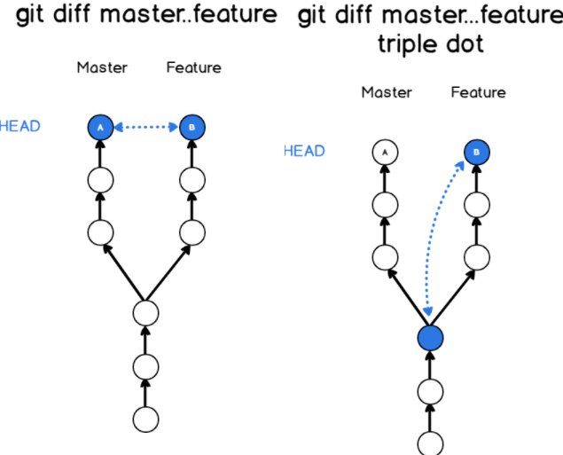

# 10. Gün Staj Notları

## Yapılacaklar

- [ ] Aktif dokümandaki generated code sıralandıktan sonra versiyon geçmişi ile kıyasla
- [ ] Versiyon geçmişindekindeki kodu da sırala

## Branch Kıyaslama Senaryosu

TODO

## Git ile Branch Kıyaslama 

```bash
git diff branch1..branch2   # 2 branch'in son sürümlerini kıyaslar
git diff branch1...branch2  # 2. branch'in son sürümü ile 1.branch ile kesişimi kıyaslanır
```



> - [How to compare two branches](https://devconnected.com/how-to-compare-two-git-branches/)
> - [Comparing two branches in Git? [duplicate]](https://stackoverflow.com/a/9834872s)

## VSIX için Dialog Box Oluşturma


### Bağımlılıkları Tanımlama

- `Add references` alanından gerekli bağımlılıkları ekliyoruz
    - PresentationCore
    - PresentationFramework
    - WindowsBase
    - System.Xaml

> - [Create a dialog box derived from DialogWindow](https://docs.microsoft.com/en-us/visualstudio/extensibility/creating-and-managing-modal-dialog-boxes?view=vs-2019&redirectedfrom=MSDN#create-a-dialog-box-derived-from-dialogwindows)

### Dialog penceresini oluşturma

- `Add new folder` ile `Dialogs` adı altında dizin açın
- Dizine sağ tıklayıp `Add` - `New İtem` - `User Control (WPF)` ile `xaml` ve `xaml.cs` dosyaları oluşturuyoruz
- `*.xaml.cs` dosyasındaki `UserControl` -> `DialogWindow` olarak güncellenecek
- `*.xaml` dosyasına aşağıdaki değişiklikler yapılmıştır
    - `xmlns:platformUi="clr-namespace:Microsoft.VisualStudio.PlatformUI;assembly=Microsoft.VisualStudio.Shell.15.0"` (15 değeri güncel sürümlerde değişebilir)
    - `platformUi:DialogWindow`
    - `WindowStartupLocation="CenterScreen" Width="500" Height="200"`

```xml
<platformUi:DialogWindow x:Class="<NAMESPACE>.<CLASS_NAME>"
             xmlns="http://schemas.microsoft.com/winfx/2006/xaml/presentation"
             xmlns:x="http://schemas.microsoft.com/winfx/2006/xaml"
             xmlns:mc="http://schemas.openxmlformats.org/markup-compatibility/2006" 
             xmlns:d="http://schemas.microsoft.com/expression/blend/2008" 
             xmlns:platformUi="clr-namespace:Microsoft.VisualStudio.PlatformUI;assembly=Microsoft.VisualStudio.Shell.15.0"
             mc:Ignorable="d" 
             WindowStartupLocation="CenterScreen"
             Width="500" Height="200">
    
    <!--Title="Örnek amaçlı GUI"-->
    <Border Margin="5" >
        <Grid>
            <Grid.RowDefinitions>
                <RowDefinition Height="Auto"/>
                <RowDefinition Height="Auto"/>
                <RowDefinition Height="Auto"/>
                <RowDefinition Height="*"/>
                <RowDefinition Height="Auto"/>
            </Grid.RowDefinitions>
            <TextBlock Text="Compare with the given branch: " Margin="5"/>
            <TextBox Grid.Row="1" x:Name="SelectionTextBox" Margin="5" MaxHeight="100" 
                     ScrollViewer.VerticalScrollBarVisibility="Auto"
                     />
            <TextBlock Grid.Row="2" Margin="5">Commit hash:</TextBlock>
            <TextBox Grid.Row="3" x:Name="DocumentationTextBox"
                     AcceptsReturn="True" TextWrapping="Wrap" HorizontalAlignment="Stretch" Margin="5"
                     ScrollViewer.VerticalScrollBarVisibility="Auto"/>
            <StackPanel Orientation="Horizontal" HorizontalAlignment="Right" Grid.Row="4">
                <Button Margin="5" Padding="5" Click="OnSave">Save</Button>
                <Button Margin="5" Padding="5" Click="OnCancel">Cancel</Button>
            </StackPanel>
        </Grid>
    </Border>
</platformUi:DialogWindow>
```

- Code tarafında aşağıdaki method ile diyalog penceresini gösteriyoruz

```c#
private void ShowCompareWithHistoryWindow()
{
    var compareFileWithHistoryDialog = new CompareWithHistoryDialog("Microsoft.VisualStudio.PlatformUI.DialogWindow")
    {
        HasMinimizeButton = false,
        HasMaximizeButton = false
    };
    compareFileWithHistoryDialog.ShowDialog();
}
```

> - [Options for displaying modal dialogs in Visual Studio extensions](https://www.visualstudiogeeks.com/extensibility/visual%20studio/options-for-displaying-modal-dialogs-in-visual-studio-extensions#use-vs-sdk)
> - [Options for displaying modal dialogs in Visual Studio extensions - GitHub Changes](https://github.com/onlyutkarsh/XamlDialogInVSExtensionDemo/commit/616a945e3399e4869c6cd4ef28cb5b377495559b)
> - [Part 4: Show a popup Window](https://michaelscodingspot.com/visual-studio-2017-extension-development-tutorial-part-4-show-a-popup-window/)
> - [Part 4: Show a popup Window - Github Source Code](https://github.com/michaelscodingspot/CodyDocs/tree/Part4/CodyDocs)

### OnClick ve OnSave eylemleri tanımlama

- `xaml` dosyası içerisinde aşağıdaki gibi tanımlanan butonlar için kaynak kod örneği verilmiştir

```xml
<Button Margin="5" Padding="5" Click="OnSave">Save</Button>
<Button Margin="5" Padding="5" Click="OnCancel">Cancel</Button>
```

```c#
public partial class <CLASS_NAME> : DialogWindow
{
    public <CLASS_NAME>(string helpTopic) : base(helpTopic)
    {
        InitializeComponent();
    }

    private void OnCancel(object sender, RoutedEventArgs e)
    {
        this.Close();
    }

    private void OnSave(object sender, RoutedEventArgs e)
    {
        // TODO
        MessageBox.Show("Save");
    }
}
```

> - [Part 4: Show a popup Window](https://michaelscodingspot.com/visual-studio-2017-extension-development-tutorial-part-4-show-a-popup-window/)

## Tüm Methodlar `Utility` Sınıfı Altında Derlendi

- Tekrarlı kodların kullanımı engellendi
- Methodlar sadeleştirildi

## XAML Notları

### Sabit değer ekleme ve kullanma

- `platformUi:DialogWindow` xaml objesinin en üstteki tagını temsil eder (sizde farklıdır)

```xml
<platformUi:DialogWindow.Resources>
    <SolidColorBrush x:Key="brushWatermarkBackground" Color="White" />
</platformUi:DialogWindow.Resources>

<!--Title="Compare with history"-->
<Grid Background="{StaticResource brushWatermarkBackground}">
```

### Değiştirilemez text box 

- TextBox özelliklerine `IsReadOnly="True"` ekleyin
- `IsDefault="True"` otomatik olarak odaklanılan buton
