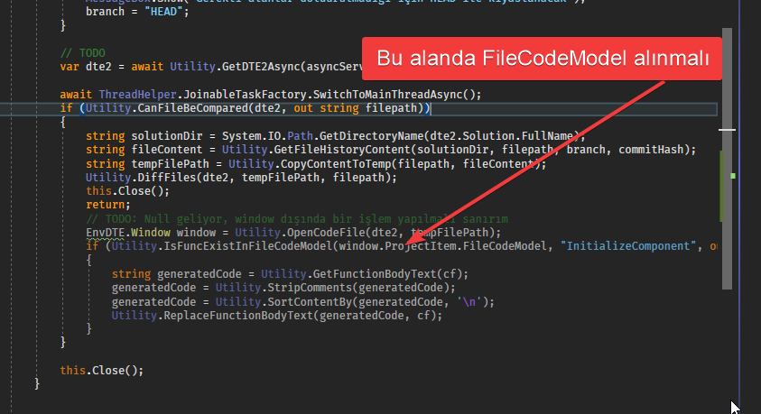

# 11. Gün Staj Notları

## VSIX Proje Dışındaki Dosyadan FileCodeModel Alma

- [ ] FileCodeModel null geliyor
- Window dışında bir yöntem olmalı
- En kötü regex ile içeriği sıralarsın

> - [Visual Studio extension: get language / file type from file name or ProjectItem](https://stackoverflow.com/a/54317290)
