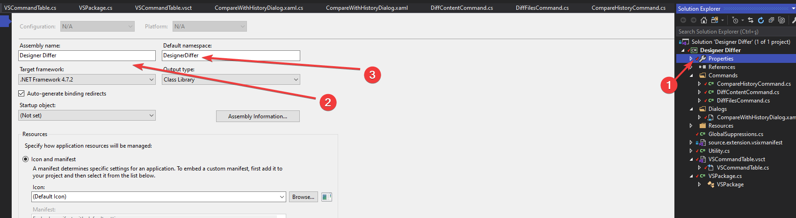
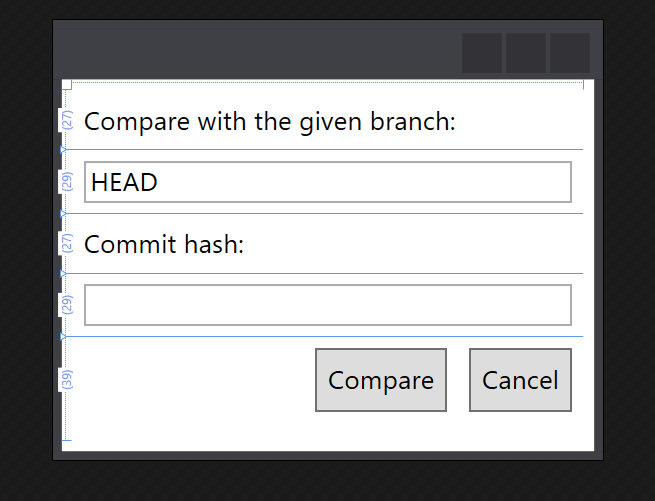

# 14. Gün Staj Notları

## Eklenti için Son Geliştirmeler

- Projeye dahil edilen dosya işlem sonrasında kaldırılmakta
- `Utility` içerisindeki methodlar sadeleştirildi
- Form tasarımı sadeleştirildi
- Hatalar için uyarı mesajları eklendi

## Proje İsmi Güncelleme

- `Solution Explorer` üzerinden `Properties` alanından güncellenir



## Dialog Pencersesi Güncellendi



## Designer Dosyasının Önceki Sürümleri ile Sıralanarak Karşılaştırılması Geliştirildi

```c#
private async void OnSave(object sender, RoutedEventArgs e)
{

    string branch = this.BranchTextBox.Text.Trim();
    string commitHash = this.CommitHashTextBox.Text.Trim();

    if (branch == "")
    {
        MessageBox.Show("Gerekli alanlar doldurulmadığı için HEAD ile kıyaslanacak");
        branch = "HEAD";
    }

    var dte2 = await Utility.GetDTE2Async(asyncServiceProvider);

    await ThreadHelper.JoinableTaskFactory.SwitchToMainThreadAsync();
    if (Utility.CanFileBeCompared(dte2, out string filePath))
    {
        string solutionDir = System.IO.Path.GetDirectoryName(dte2.Solution.FullName);
        string fileContent = Utility.GetFileHistoryContent(solutionDir, filePath, branch, commitHash);
        string tempFilePath = Utility.CopyContentToTemp(filePath, fileContent);

        ProjectItem selectedProjectItem = dte2.ItemOperations.AddExistingItem(filePath);
        FileCodeModel selectedFileCodeModel = selectedProjectItem.FileCodeModel;
        if (selectedFileCodeModel != null)
        {
            if (Utility.SortFunctionBodyIfExist(selectedFileCodeModel, Utility.GeneratedFunctionName))
            {
                ProjectItem tempProjectItem = dte2.ItemOperations.AddExistingItem(tempFilePath);
                if (Utility.SortFunctionBodyIfExist(tempProjectItem.FileCodeModel, Utility.GeneratedFunctionName))
                {
                    tempProjectItem.Save();
                    string oldFilePath = filePath.Replace(selectedProjectItem.Name, tempProjectItem.Name);
                    Utility.DiffFiles(dte2, oldFilePath, filePath);
                }
                else
                {
                    MessageBox.Show("Seçili dosyanın belirtilen commit hash için kaydı git ile bulunamadı");
                }
                tempProjectItem.Delete();
            }
            else
            {
                MessageBox.Show("Seçili dosya designer dosyası değil");
            }
        }
        else
        {
            MessageBox.Show("Dosya içeriği desteklenmiyor");
        }
    }
    this.Close();
}
```
