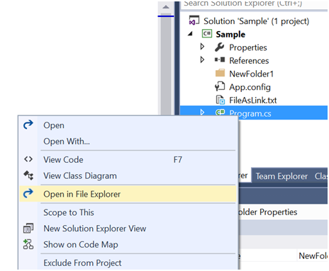

# 4. Gün Çalışma Notları

## Son Kalınan Yerler

- [22:45 VS Extensibility 2015](https://channel9.msdn.com/events/Build/2016/B886)
- [DTE2 Interface](https://docs.microsoft.com/en-us/dotnet/api/envdte80.dte2?view=visualstudiosdk-2017)
- [Getting started writing Visual Studio extensions](https://devblogs.microsoft.com/visualstudio/getting-started-writing-visual-studio-extensions/)
- `File Diff Solutions` projesinde kalındı

## VSIX Eklentisi Yapımı



- [Context menu sabitleri](https://docs.microsoft.com/en-us/archive/blogs/martintracy/common-context-menu-constants)

> [Visual Studio Extensibility (Day 1): Creating your first Visual Studio VSIX package](https://www.codeproject.com/Articles/1169776/Visual-Studio-Extensibility-Day-Creating-your-firs)

### Eklentinin Dahil Olacağı Grubu Belirleme

- `IDM_VS_CTXT_ITEMNODE` sağ tıklandığında karşımıza çıkar
- `priority` konum değeri, az olursa yukarı çıkar

```html
<Groups>
    <Group guid="guidFile_DifferPackageCmdSet" id="MyMenuGroup" priority="0x0300">
    <Parent guid="guidSHLMainMenu" id="IDM_VS_CTXT_ITEMNODE"/>
    </Group>
</Groups>
```

### VS API ile Haberleşme

- Tüm API işlemleri VS Servis Objeleri ile gerçekleşir
- `public static async Task` yapısı içerisinde `await` ile alınmalı

```c#
OleMenuCommandService commandServic = await package.GetServiceAsync(typeof(IMenuCommandService)) as OleMenuCommandService
 ```

### C# Koduna Bağlanma Kodları

- `GUID` değeri ve `CommandID` olarak `*Command.cs` dosyası ile aynıdır

```html
<GuidSymbol name="guidFile_DifferPackageCmdSet" value="{020df2a1-db50-4da9-b02d-429321000270}">
      <IDSymbol name="MyMenuGroup" value="0x1020" />
      <IDSymbol name="DiffFilesCommandId" value="0x0100" />
</GuidSymbol>
```

### VS Komutlarını Bulma

- `Command Window` üzerinden tüm VS komutlarını görebiliriz
- `DTE2` objesi ile ExecuteCommand metoduyla çalıştırabiliriz

## C# ile DLL Kullanımı

- Harici dll dosyaları kullanmak için `extern` keywordu kullanılır

```c#
[DllImport("User32.dll", CharSet=CharSet.Unicode)]
public static extern int MessageBox(IntPtr h, string m, string c, int type);
```

### C ile DLL Örneği

```c
// cmdll.c
// Compile with: -LD
int __declspec(dllexport) SampleMethod(int i)
{
  return i*10;
}
```

### C# ile kullanımı
```c#
// cm.cs
using System;
using System.Runtime.InteropServices;
public class MainClass
{
    [DllImport("Cmdll.dll")]
      public static extern int SampleMethod(int x);

    static void Main()
    {
        Console.WriteLine("SampleMethod() returns {0}.", SampleMethod(5));
    }
}
```

> [C# Extern](https://docs.microsoft.com/tr-tr/dotnet/csharp/language-reference/keywords/extern)

## VS SDK Dosya Yolunu Alma

```c#
private static EnvDTE80.DTE2 GetDTE2() => Package.GetGlobalService(typeof(EnvDTE.DTE)) as EnvDTE80.DTE2;
private string GetSourceFilePath()
{
    ThreadHelper.ThrowIfNotOnUIThread();
    EnvDTE80.DTE2 _applicationObject = GetDTE2();
    EnvDTE.UIHierarchy uih = _applicationObject.ToolWindows.SolutionExplorer;
    Array selectedItems = (Array)uih.SelectedItems;
    if (null != selectedItems)
    {
        foreach (EnvDTE.UIHierarchyItem selItem in selectedItems)
        {
            EnvDTE.ProjectItem prjItem = selItem.Object as EnvDTE.ProjectItem;
            string filePath = prjItem.Properties.Item("FullPath").Value.ToString();
            //System.Windows.Forms.MessageBox.Show(selItem.Name + filePath);
            return filePath;
        }
    }
    return string.Empty;
}
```

## VS 2017 SDK Dosya Adını Alma

```c#
using EnvDTE;
using EnvDTE80;

private void Execute(object sender, EventArgs e)
{
    DTE2 application = Package.GetGlobalService(typeof(SDTE)) as DTE2;
    foreach (SelectedItem selectedItem in application.SelectedItems)
    {
        string path = selectedItem.Name;
        VsShellUtilities.ShowMessageBox(
        this.package,
        path,
        application.Name,
        OLEMSGICON.OLEMSGICON_INFO,
        OLEMSGBUTTON.OLEMSGBUTTON_OK,
        OLEMSGDEFBUTTON.OLEMSGDEFBUTTON_FIRST);
    }
}
```

> - [Problem with DTE2 for Running Commands in Visual Studio](https://stackoverflow.com/a/53597163)
> - [Visual Studio 2015 Extensibility - Video](https://www.youtube.com/watch?v=MFiRotBsVKU)

## Son Eklenen Kodlar

```c#
/// <summary>
    /// This function is the callback used to execute the command when the menu item is clicked.
    /// See the constructor to see how the menu item is associated with this function using
    /// OleMenuCommandService service and MenuCommand class.
    /// </summary>
    /// <param name="sender">Event sender.</param>
    /// <param name="e">Event args.</param>
    [System.Diagnostics.CodeAnalysis.SuppressMessage("Usage", "VSTHRD100:Avoid async void methods", Justification = "<Pending>")]
    private async void Execute(object sender, EventArgs e)
    {
        var dte = await ServiceProvider.GetServiceAsync(typeof(DTE)).ConfigureAwait(false) as DTE2 ?? throw new NullReferenceException("DTE alınamadı");
        string file1, file2;

        await ThreadHelper.JoinableTaskFactory.SwitchToMainThreadAsync();
        if (CanFilesBeCompared(dte, out file1, out file2))
        {
            dte.ExecuteCommand("Tools.DiffFiles", $"\"{file1}\" \"{file2}\"");
        }
    }

    /// <summary>
    /// 2 dosyanın kıyaslanabilir olup olmadağını kontrol eder
    /// </summary>
    /// <param name="dte"></param>
    /// <param name="file1"></param>
    /// <param name="file2"></param>
    /// <returns></returns>
    public static bool CanFilesBeCompared(DTE2 dte, out string file1, out string file2)
    {
        var items = GetSelectedFiles(dte);
        file1 = items.ElementAtOrDefault(0);
        file2 = items.ElementAtOrDefault(1);

        return !string.IsNullOrEmpty(file1) && !string.IsNullOrEmpty(file2);
    }

    /// <summary>
    /// Dosya yollarının bilgilerini verir
    /// </summary>
    /// <param name="dte">VS için otomasyon objesi</param>
    /// <returns></returns>
    public static IEnumerable<string> GetSelectedFiles(DTE2 dte)
    {
        ThreadHelper.ThrowIfNotOnUIThread();
        var items = (Array)dte.ToolWindows.SolutionExplorer.SelectedItems;
        return from item in items.Cast<UIHierarchyItem>()
                let pi = item.Object as ProjectItem
                select pi.FileNames[1];
    }
}
```
