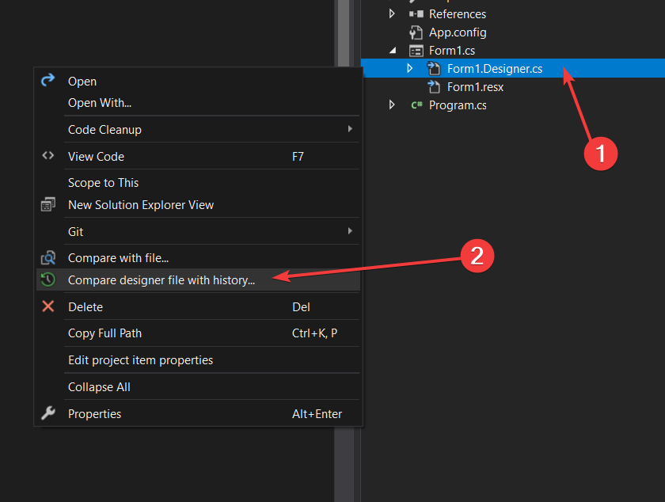
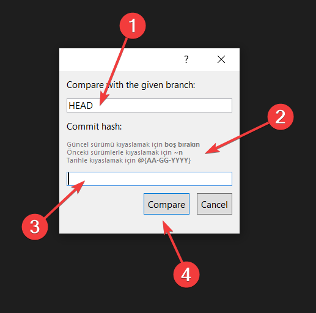
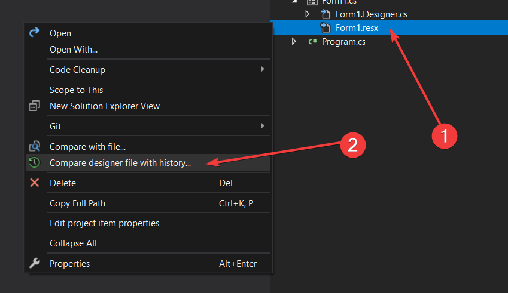
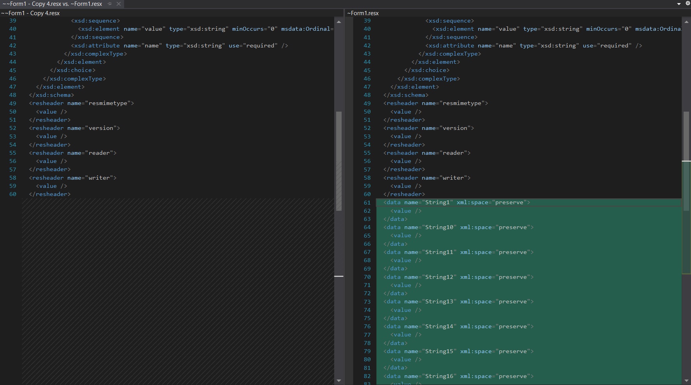
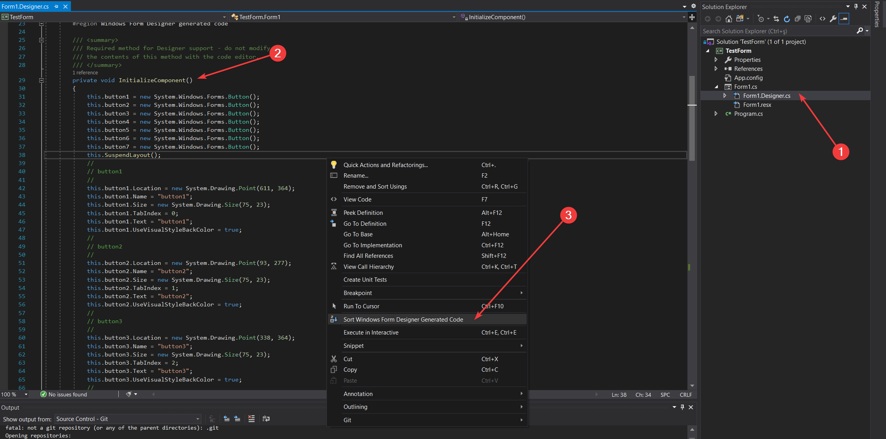
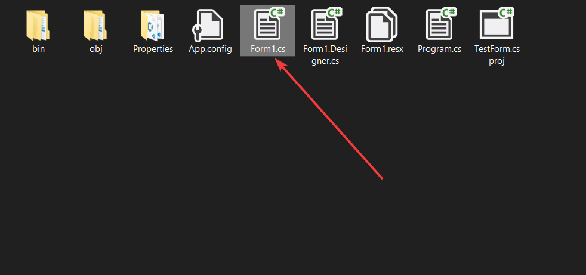
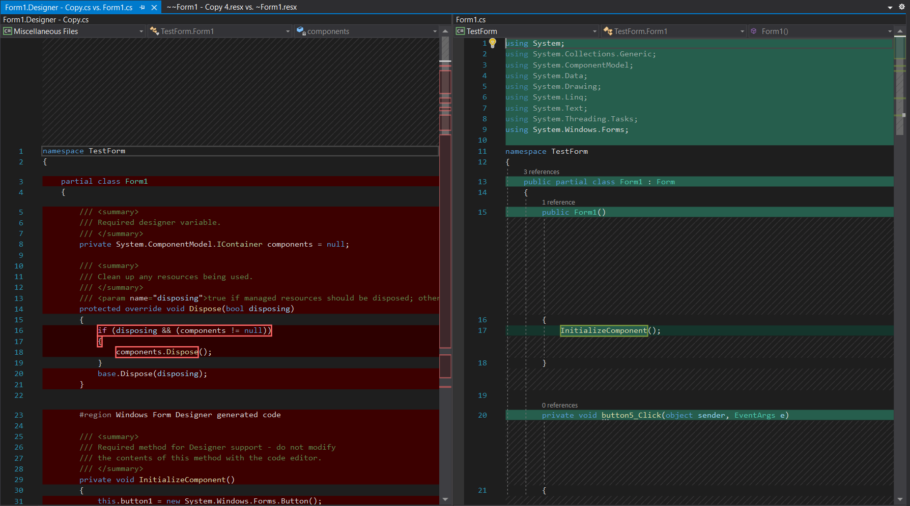

# 🔍 Designer Differ

Visual Studio Designer tarafından üretilen kodlardaki karmaşıklığı azaltıp, git ile düzgün bir versiyon kıyaslaması sağlayan eklenti

| | |
|-|-|
|👨‍💻 Yapımcı |        🤵 Yunus Emre AK ~ [YEmreAk.com](https://yemreak.com)|
|✨ Son Güncelleme| 📅 10.09.2020 |

## 🎯 Eklentinin Amaçları

| 💎 Özellik | 🎯 Amaç |
| - | - |
| 🎨 Designer Dosyalarını Kıyaslama | Windows Form Designer tarafından otomatik olarak oluşturulan kodların konumlarındaki tutarsız değişiklikler, git üzerinde sanki yeni bir satır eklenmiş veya silinmiş gibi gösterilmektedir. Bu işlem de değişiklikleri algılamada sorun oluşturmaktadır. Sorunun çözümüne odaklı bir özelliktir |
| 📂 Resx Dosyalarını Kıyaslama | Windows Resx Designer tarafından otomatik olarak oluşturulan kodların konumlarındaki tutarsız değişiklikler, git üzerinde sanki yeni bir satır eklenmiş veya silinmiş gibi gösterilmektedir. Bu işlem de değişiklikleri algılamada sorun oluşturmaktadır. Sorunun çözümüne odaklı bir özelliktir |
| 🚄 Designer Üretilen Kodu Sıralama | Windows Form Designer tarafından otomatik olarak oluşturulan kodların konumlarındaki tutarsız değişiklikler, git üzerinde sanki yeni bir satır eklenmiş veya silinmiş gibi gösterilmektedir. Bu işlem de değişiklikleri algılamada sorun oluşturmaktadır. Sorunun çözümüne odaklı bir özelliktir |
| 📃 Herhangi İki Dosyayı Kıyaslama | Herhangi bir iki dosya arasındaki farklılıkları kolayca tespit etmeyi sağlayan bir özelliktir |

## 🤹 Eklentinin Çalışma Algoritması

- 📦 Eklenti özelliklerinin çalışabilmesi için [Git](https://git-scm.com/downloads) kurulumu olmalıdır
- ➕ Seçili dosyanın yolunu alır ve kaynak kodlarına erişmek için geçici olarak projeye dahil eder
- 🚧 Projeye dahil edilen kodda sıralama işlemleri gerçekleştirilir ve dosya kaydedilir
- 🚚 Güncellenen dosya işletim sistemi tarafından otomatik olarak temizlenen `%TEMP%` dizinine `~` ön ekleri ile kopyalanır
- 💦 Projeye dahil edilen dosya projeden çıkarılır ve silinir
- 🔍 `%TEMP%` dizinine kaydedilen dosyalar Visual Studio Diff Tool ile git kullanarak kıyaslanır

## 🎨 Designer Dosyalarını Kıyaslama

- 📃 Herhangi bir `*.Designer.cs` dosyasına sağ tıklayın
- 📋 Açılan menüde `Compare designer file with history...` butonunu seçin

- 🔀 Açılan diyalog ekranında `HEAD` olarak yazan, kıyaslanma yapılacak branch ismini temsil eder
- 🆔 `CommitHash` kısmı için gerekli açıklamalar form üzerinde verilmiştir
- 📝 Kıyaslama yapmak istediğiniz sürüm için 3. alanı doldurun
- ✔️ <kbd>↩ Enter</kbd> butonuna veya `Compare` butonuna basarak kıyaslamayı başlatın
- ❌ <kbd>⎋ Esc</kbd> veya `Cancel` butonuna basarak kıyaslamayı iptal edebilirsiniz

> 📢 Kıyaslama işleminde dosyanın güncel hali ile istenen eski sürümü işletim sistemi tarafından otomatik olarak temizlenen `%TEMP%` dizinine sırasıyla `~` `~~` ön ekleriyle kopyalanır, gösterilen dosyalardaki değişiklikler asıl dosyayı etkilemez

- 📹 Kıyaslama sonrasında oluşacak çıktı aşağıdaki gibidir

## 📂 Resx Dosyalarını Kıyaslama

- 📃 Herhangi bir `*.resx` dosyasına sağ tıklayın
- 📋 Açılan menüde `Compare designer file with history...` butonunu seçin

- 🔀 Açılan diyalog ekranında `HEAD` olarak yazan, kıyaslanma yapılacak branch ismini temsil eder
- 🆔 `CommitHash` kısmı için gerekli açıklamalar form üzerinde verilmiştir
- 📝 Kıyaslama yapmak istediğiniz sürüm için 3. alanı doldurun
- ✔️ <kbd>↩ Enter</kbd> butonuna veya `Compare` butonuna basarak kıyaslamayı başlatın
- ❌ <kbd>⎋ Esc</kbd> veya `Cancel` butonuna basarak kıyaslamayı iptal edebilirsiniz

> 📢 Kıyaslama işleminde dosyanın güncel hali ile istenen eski sürümü işletim sistemi tarafından otomatik olarak temizlenen `%TEMP%` dizinine sırasıyla `~` `~~` ön ekleriyle kopyalanır, gösterilen dosyalardaki değişiklikler asıl dosyayı etkilemez

- 📹 Kıyaslama sonrasında oluşacak çıktı aşağıdaki gibidir

## 🚄 Designer Üretilen Kodu Sıralama

- 📃 Herhangi bir `*.Designer.cs` dosyasını açın ve açılan pencere içerisine sağ tıklayın
- 📋 Açılan menüde `Sort Windows Form Designer Generated Code` butonunu seçin

> 📢 Sıralama sırasında verileri koruma amacıyla sıralanmış kodları dosyaya kaydetmez, dilerseniz <kbd>✲ Ctrl</kbd> <kbd>S</kbd> kısayolu ile kaydedebilirsiniz.

- 📹 Kıyaslama sonrasında oluşacak çıktı aşağıdaki gibidir

## 📃 Herhangi İki Dosyayı Kıyaslama

- 📃 Herhangi bir dosyaya sağ tıklayın
- 📋 Açılan menüde `Compare with file...` butonunu seçin

> 📢 İsterseniz 2 dosyayı birden seçip sağ tıklayarak, ikisi arasındaki farkları görebilirsiniz

- 🗃️ Eğer iki dosya seçmediyseniz, dosya gezgini üzerinden, istediğiniz bir dosyayı seçin

- 📹 Kıyaslama sonrasında oluşacak çıktı aşağıdaki gibidir

