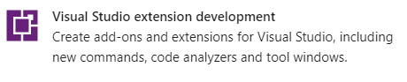

# 🧩 Visual Studio Eklentisi Programlama

## 💎 Ön Gereksinimler

Eklentiyi Visual Studio için C# ile programlamlayacağımızdan dolayı:

- ⏬ `Visual Studio` ve `Visual Studio extension development` iş yükü indirilmelidir
- 💁‍♂️ Eklenti için derinden bir C# bilgisi yerine hızlı bir öğrenmeye odaklanılması kafidir
- 🏃‍♂️ Hızlıca C# öğrenmek için [CSharp Quick Guide](https://www.tutorialspoint.com/csharp/csharp_quick_guide.htm) sayfasına bakmalısın
- 👮‍♂️ Yazım standartları için [CSharp Coding Standarts](https://www.dofactory.com/reference/csharp-coding-standards) alanına da bakabilirsin

> 📃 C# Hakkında bilgi için [C# Quick Start](./assets/C#%20Quick%20Start.pdf) pdf notlarımı da inceleyebilirsin

## Çalışma Yolu

- Eklenti programlanır, derlenir ve çalıştırılır
- GitHub üzerinden versiyon kontrol sistemi ile ilerleme kontrol edilir
- Derlenme ve test işlemleri Continious Integration (CI) ile otomatikleştirilir
- Herkese açık stabil bir sürümü üzerinden eklenti yayınlanır
- VS Gallery üzerine eklenti aktarılır

### 🏗️ VSIX Eklentisi Proje Yapısı

- `vcst` ve `vsixmanifest` dosyası `sync` edilmeli

