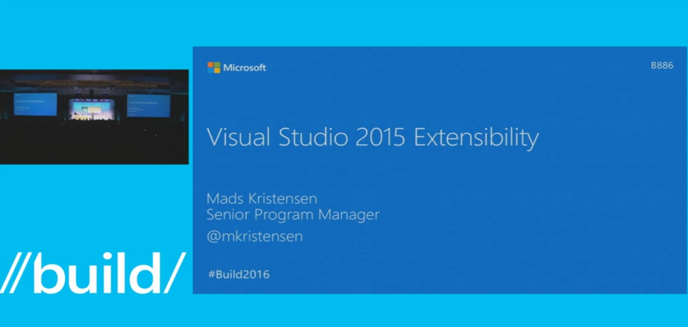
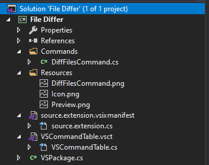
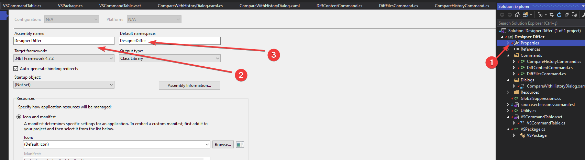

# 🧩 Visual Studio Eklentisi Programlama

## 💎 Ön Gereksinimler

Eklentiyi Visual Studio için C# ile programlamlayacağımızdan dolayı:

- ⏬ `Visual Studio` ve `Visual Studio extension development` iş yükü indirilmelidir
- 💁‍♂️ Eklenti için derinden bir C# bilgisi yerine hızlı bir öğrenmeye odaklanılması kafidir
- 🏃‍♂️ Hızlıca C# öğrenmek için [CSharp Quick Guide](https://www.tutorialspoint.com/csharp/csharp_quick_guide.htm) sayfasına bakmalısın
- 👮‍♂️ Yazım standartları için [CSharp Coding Standarts](https://www.dofactory.com/reference/csharp-coding-standards) alanına da bakabilirsin

> 📃 C# Hakkında bilgi için [C# Quick Start](./assets/C#%20Quick%20Start.pdf) pdf notlarımı da inceleyebilirsin


## 🔰 VSIX Yapımına Hazırlanma

Aşağıdaki video ile başlangıç seviyesi için hızlıca gerekli bilgileri öğrenebilirsin

[](https://channel9.msdn.com/Events/Build/2016/B886/player)


### 🏗️ VSIX Eklentisi Proje Yapısı

- `vcst` ve `vsixmanifest` dosyası `sync` edilmeli



### 👨‍🔧 Proje İsmi Güncelleme

- `Solution Explorer` üzerinden `Properties` alanından güncellenir



## 🤖 VSIX Komutları için Guid Otomasyonu

- Aşağıdaki alanlar senkronize olan `vsct` c# dosyasından çekilmelidir

```c#
internal sealed class CompareHistoryCommand
{
    /// <summary>
    /// Command ID.
    /// </summary>
    public const int CommandId = PackageIds.CompareHistoryCommandId;

    /// <summary>
    /// Command menu group (command set GUID).
    /// </summary>
    public static readonly Guid CommandSet = PackageGuids.guidFile_VSPackageCmdSet;
// ...
}
```

## 🆔 VS SDK Menu ID'leri

- [GUIDs and IDs of Visual Studio menus](https://docs.microsoft.com/en-us/visualstudio/extensibility/internals/guids-and-ids-of-visual-studio-menus?view=vs-2019s)
- [IDE-Defined Commands for Extending Project Systems](https://docs.microsoft.com/en-us/visualstudio/extensibility/internals/ide-defined-commands-for-extending-project-systems?view=vs-2019s)


## 🖼️ VSIX için ikon ekleme


- 🌟 PNG dışındaki formatları da destekler ama PNG kullan
- 📦 VSIX'de 3000 icon vardır bunları kullanabilmek için [Extensibility Essentials 2019](https://marketplace.visualstudio.com/items?itemName=MadsKristensen.ExtensibilityEssentials2019) eklentisini indir
- ⚙️ View -> Other Windows -> KnownMoniker
- 📝 Çıkan panelde seçilen ikonu Resource içerisine alttak özelliklerle eklemeliyiz:
  - `16 width` ile  `*Command.png` icon dosyasını overwrite ederek
  - `175 width` ile `Preview` isimle
  - `90 width` ile `Icon` isimle
- 💦 `*.vsct` dosyası içerisinde **silmen gereken** kısımlar
  -  `Bitmap` alanında `usedList` kısmındaki değerlerden ilki hariç diğerlerini
  -  `GuidSymbol` alanındaki `IDSymbol` satırlarından ilki hariç diğerlerini
- ➕ Son eklenen resimleri projeye dahil etmek için `Solution Explorer` alanında  sağdan 3. ikon `Show all files` ile resimleri bulup, onları seçip `Include From Project` demeliyiz

- 🔨 ``*.vsixmanifest` dosyasına ikon ve ön izleme resmi eklenmeli


## 🐥 Visual Studio Ortam Objelerine Erişme

- 💠 IDE objelerine erişmek için `EnvDT80.DTE2` objesi kullanılır
- 🍎 `await <asyncServiceProvider>.GetServiceAsync(typeof(DTE)).ConfigureAwait(false) as DTE2` kodu ile DTE objesi alınır
- 📂 `dte2.ItemOperations` kodu ile dosya açma, ekleme ve benzeri işlemler IDE ile otomatikleştirilebilir

| Kod | Açıklama|
| -   | -        |
| `dte2.ActiveDocument` | IDE üzerinde aktif olan doküman |
| `dte2.ActiveDocument.ProjectItem` | Aktif dokümanın proje objesi (kaynak kodlara vb erişim)
| `dte2.ToolWindows.SolutionExplorer.SelectedItems` | Solution Explorer üzerindeki seçilen dosyalara erişiriz|
| `dte2.ExecuteCommand("<komut>", "<argümanlar>")` | Command Window üzerinde komut çalıştırır |
| `dte2.ItemOperations.AddExistingItem(<filepath>)` | Projeye var olan dosyayı ekler ve yolun -proje dizininde olduğundan-  günceller |
| `dte2.ItemOperations.OpenFile(<filepath>)` | IDE ile dosyayı açar, projeye dahil etmem, kaynak kod derlenmez (FileCodeModel olmaz) |


## 📁 ProjectItem

- 💡 Solution içerisinde yer alan ve derlenen proje dosyasını tutan objedir
- 🤖 Dosya üzerindeki otomasyon işlemleri bu obje ile yapılır
- 📂 Dosya işlemleri `<projectItem>.Delete()`, `<projectItem>.Save()`, `<projectItem>.Remove()` gibi işlemler buradan yapılır
- 👨‍💻 Dosya içerisindeki kaynak kod modeline `<projectItem>.FileCodeModel` şeklinde erişebiliriz

```c#
ProjectItem selectedProjectItem = dte2.ItemOperations.AddExistingItem(filePath);
FileCodeModel selectedFileCodeModel = selectedProjectItem.FileCodeModel;
```

## 👨‍💻 FileCodeModel

- 💡 IDE üzerinde derlenen (build) proje dosyaları (ProjectItem) kaynak kodlarını tutan modeldir
- 🍏 `CodeElements` olan kod elemanlarını tutan objelerden oluşur
- 🍎 `CodeNamespace`, `CodeElement`, `CodeClass`, `CodeFunction` gibi kaynak kod özelliğine göre obje içerir
- 👨‍💻 `<codeNamespace | codeClass >.Children` komutu ile namespace veya class içerisindeki kaynak kod objelerine erişilir

> 📢 Derlenmemiş dosyalarda - yani projeye dahil olmayan harici dosyalar olan `Miscellaneous` dosyalarında - FileCodeModel olmaz

```c#
public static bool IsFuncExistInCodeElements(CodeElements codeElements, string name, out CodeFunction cf)
{
    ThreadHelper.ThrowIfNotOnUIThread();
    foreach (CodeElement element in codeElements)
    {
        if (element is CodeNamespace)
        {
            CodeNamespace nsp = element as CodeNamespace;

            foreach (CodeElement subElement in nsp.Children)
            {
                if (subElement is CodeClass)
                {
                    CodeClass c2 = subElement as CodeClass;
                    foreach (CodeElement item in c2.Children)
                    {
                        if (item is CodeFunction)
                        {
                            CodeFunction _cf = item as CodeFunction;
                            if (_cf.Name == name)
                            {
                                cf = _cf;
                                return true;
                            }
                        }
                    }
                }
            }
        }
    }
    cf = null;
    return false;
}
```

## 🍏 CodeElement

- 🐥 CodeElement objelerinin metinlerine `<codeElement>.GetStartPoint(vsCMPart.vsCMPartBody).CreateEditPoint()` şeklinde erişilir
- 📌 `GetStartPoint(<vsCMPart>)` ile enum değerleri olarak tanımlanan alanların başlangıc konumu alınır
- 🔤 `CreateEditPoint` ile konum bilgisinden içerik metnine erişilir
- İçerik metni üzerinden `GetText(<point>)`, `ReplaceText(<point>)` gibi komutlar metni değiştirebiliriz
- 📝 Obje sonuna kadar almak veya değiştirmek için `<codeElement>.EndPoint` değeri kullanılır

```c#
public static bool IsFuncExistInCodeElements(CodeElements codeElements, string name, out CodeFunction cf) 
{
    string functionBodyText = cf.GetStartPoint(vsCMPart.vsCMPartBody).CreateEditPoint().GetText(cf.EndPoint);
    funcitonBodyText = "Test";
    cf.GetStartPoint(vsCMPart.vsCMPartBody).CreateEditPoint().ReplaceText(cf.EndPoint, funcitonBodyText, (int)vsEPReplaceTextOptions.vsEPReplaceTextAutoformat);
}
```
