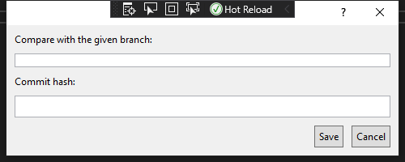

# 👨‍💻 VSIX ile Kod Örnekleri

## VSIX Aktif Dökümanın İçeriğini Alma

```c#
protected DTE2 dte;
dte2 = (EnvDTE80.DTE2)GetService(typeof(EnvDTE.DTE));

public string GetCurrentTextFile(){

  TextDocument doc = (TextDocument)(dte.ActiveDocument.Object("TextDocument"));
  var p = doc.StartPoint.CreateEditPoint();
  string s = p.GetText(doc.EndPoint);

  return s;            
}
```

> [In VisualStudio DTE, how to get the contents of the ActiveDocument?](https://stackoverflow.com/questions/10606274/in-visualstudio-dte-how-to-get-the-contents-of-the-activedocument)

## Editör Üzerindeki Seçili Metni Sıralama

```c#
using EnvDTE80;

var dte = await ServiceProvider.GetServiceAsync(typeof(DTE)).ConfigureAwait(false) as DTE2 ?? throw new NullReferenceException("DTE alınamadı");
EnvDTE.TextSelection ts = dte.ActiveWindow.Selection as EnvDTE.TextSelection;
if (ts == null)
    return;

string[] selectedLines = ts.Text.Split('\n');
selectedLines = selectedLines.OrderBy(p => p).ToArray();
ts.Text = string.Join("\n", selectedLines);
```
> - [How to get selected text of visual studio 2015 editor windows?](https://stackoverflow.com/a/40508224)
> - [Read a text file and sort in C#](https://gist.github.com/Ellyll/7716439)

## Editör Üzerindeki Seçili Metnin içerisindeki Method İçeriğini Sıralama

```c#
using EnvDTE80;

var dte = await ServiceProvider.GetServiceAsync(typeof(DTE)).ConfigureAwait(false) as DTE2 ?? throw new NullReferenceException("DTE alınamadı");

EnvDTE.TextSelection ts = dte.ActiveWindow.Selection as EnvDTE.TextSelection;
if (ts == null)
    return;
EnvDTE.CodeFunction func = ts.ActivePoint.CodeElement[vsCMElement.vsCMElementFunction] as EnvDTE.CodeFunction;
if (func == null)
    return;

// Func içerğini al -> sırala -> güncelle
string selectedCodeText = func.GetStartPoint(vsCMPart.vsCMPartBody).CreateEditPoint().GetText(func.EndPoint);
selectedCodeText = string.Join("\n", selectedCodeText.Split('\n').OrderBy(p => p));
func.GetStartPoint(vsCMPart.vsCMPartBody).CreateEditPoint().ReplaceText(func.EndPoint, selectedCodeText, (int) vsEPReplaceTextOptions.vsEPReplaceTextAutoformat);
```

> - [vs2010 automation : Get the text value of a EnvDTE.CodeElement](https://stackoverflow.com/a/21463351)
> - [Get function body programatically using Automation](https://social.msdn.microsoft.com/Forums/en-US/542a3756-6d6e-4744-a035-fc7238203857/get-function-body-programatically-using-automation?forum=vsxs)

## VSIX Aktif Dokümandaki Üretilen Kodları Sıralama

```c#
using EnvDTE80;

private async void Execute(object sender, EventArgs e) {
    DTE2 dte = await Utility.GetDTE2Async(ServiceProvider);
    ProjectItem tempProjectItem = dte2.ItemOperations.AddExistingItem(tempFilePath);
    if (Utility.SortFunctionBodyIfExist(tempProjectItem.FileCodeModel, Utility.GeneratedFunctionName))
    {
        tempProjectItem.Save();
        string oldFilePath = filePath.Replace(selectedProjectItem.Name, tempProjectItem.Name);
        Utility.DiffFiles(dte2, oldFilePath, filePath);
    }
}

public static async Task<DTE2> GetDTE2Async(IAsyncServiceProvider asyncServiceProvider) => await asyncServiceProvider.GetServiceAsync(typeof(DTE)).ConfigureAwait(false) as DTE2 ?? throw new NullReferenceException("DTE alınamadı");

public static bool SortFunctionBodyIfExist(FileCodeModel fcm, string funcName)
{
    ThreadHelper.ThrowIfNotOnUIThread();
    if (IsFuncExistInFileCodeModel(fcm, funcName, out CodeFunction cf))
    {
        SortFunctionBody(cf);
        return true;
    }
    return false;
}

public static bool IsFuncExistInFileCodeModel(FileCodeModel fcm, string name, out CodeFunction cf)
{
    ThreadHelper.ThrowIfNotOnUIThread();
    return IsFuncExistInCodeElements(fcm.CodeElements, name, out cf);
}

public static void SortFunctionBody(CodeFunction cf)
{
    ThreadHelper.ThrowIfNotOnUIThread();
    string generatedCode = GetFunctionBodyText(cf);
    generatedCode = StripComments(generatedCode);
    generatedCode = SortContentBy(generatedCode, '\n');
    ReplaceFunctionBodyText(generatedCode, cf);
}

public static bool IsFuncExistInCodeElements(CodeElements codeElements, string name, out CodeFunction cf)
{
    ThreadHelper.ThrowIfNotOnUIThread();
    foreach (CodeElement element in codeElements)
    {
        if (element is CodeNamespace)
        {
            CodeNamespace nsp = element as CodeNamespace;

            foreach (CodeElement subElement in nsp.Children)
            {
                if (subElement is CodeClass)
                {
                    CodeClass c2 = subElement as CodeClass;
                    foreach (CodeElement item in c2.Children)
                    {
                        if (item is CodeFunction)
                        {
                            CodeFunction _cf = item as CodeFunction;
                            if (_cf.Name == name)
                            {
                                cf = _cf;
                                return true;
                            }
                        }
                    }
                }
            }
        }
    }
    cf = null;
    return false;
}
```

> [Get current source file methods in Visual Studio Text Editor Extension](https://stackoverflow.com/a/45181583)


## İki Dosya Arasındaki Farklılıkları Gösterme

- Dosyayı geçici dizine aynı uzantı ve ismle kayıt ediyoruz
- Ardından `Tool.DiffFiles` komutu ile geçici dizindeki ile orjinal dosyayı karşılaştırıyoruz

```c#
string[] splitFilepath = filepath.Split('\\');
string bareFilename = splitFilepath[splitFilepath.Length - 1];
string tempFilepath = System.IO.Path.GetTempPath() + bareFilename;
System.IO.File.WriteAllText(tempFilepath, fileContent, System.Text.Encoding.UTF8);
dte2.ExecuteCommand("Tools.DiffFiles", $"\"{tempFilepath}\" \"{filepath}\"");
```

## Git Komutu Çalıştırma

### Proje dizinini ve dosya yolunu alma

```c#
string filepath = "...";
string solutionDir = System.IO.Path.GetDirectoryName(dte2.Solution.FullName);
filepath = filepath.Replace($"{solutionDir}\\", "").Replace("\\", "/");
```

> [How do you get the current solution directory from a VSPackage?](https://stackoverflow.com/a/2338796s)

### Git process oluşturma ve okuma

- `arguments` alanına 

```c#
static System.Diagnostics.Process GitProcess(string arguments, string workdir)
{
    return new System.Diagnostics.Process
    {
        StartInfo = {
            FileName = "git.exe",
            WorkingDirectory = workdir,
            Arguments = $"--no-pager {arguments}",
            RedirectStandardOutput = true,
            UseShellExecute = false,
            CreateNoWindow = true
        },
        EnableRaisingEvents = true
    };
}
```

```c#
string fileContent = "";
gitProcess.Start();
while (!gitProcess.StandardOutput.EndOfStream)
{
    string line = gitProcess.StandardOutput.ReadLine();
    fileContent += line + "\n";
}
```

> - [Process.start: how to get the output?](https://stackoverflow.com/a/4291965)
> - [Is there any async equivalent of Process.Start?](https://stackoverflow.com/a/10789196s)

## VSIX Dosyadan FileCodeModel Oluşturma

- 💡 Öncelikle stack overflow üzerindeki cevabım [buradadır](https://stackoverflow.com/a/63694279/9770490)
- 👮‍♂️ Visual Studio içerisinde açılan proje dosyalarının `FileCodeModel` objesine erişilebilir
- 🗃️ `dte.ItemOperations.OpenFile` ile açılan dosyalar, `Miscellaneous` olarak gözükür, `ProjectItem` değildir
- 📂 Dosyayı `ProjectItem` olarak açmak için `dte.ItemOperations.AddExistingItem(filePath);` kodu kullanılır
- 👨‍💻 Eklenen dosyanın `FileCodeModel` içeriğine `projectItem.FileCodeModel` şeklinde erişiriz
- İsteğe bağlı olarak` ProjectItem.Delete()` ile eklenen dosya kaldırılabilir

```c#
using EnvDTE;

public static async Task<DTE2> GetDTE2Async(IAsyncServiceProvider asyncServiceProvider) => await asyncServiceProvider.GetServiceAsync(typeof(DTE)).ConfigureAwait(false) as DTE2 ?? throw new NullReferenceException("DTE alınamadı");

string filepath = "TODO";
DTE2 dte2 = await Utility.GetDTE2Async(asyncServiceProvider);
ProjectItem projectItem = dte2.ItemOperations.AddExistingItem(filepath);
FileCodeModel fcm = projectItem.FileCodeModel;
projectItem.Delete();
```

> - [How do I programmatically add a file to a Solution?](https://stackoverflow.com/a/11934026/9770490s)
> - [FileCodeModel null for file in "Misc Files" project. ~ Windows Tech](http://www.windows-tech.info/4/004ffb867c3564c0.php)
> - [FileCodeModel null for file in "Misc Files" project. ~ Microsoft](https://social.msdn.microsoft.com/Forums/sqlserver/en-US/925a2ba3-728b-4bfd-8802-091ef258eace/filecodemodel-null-for-file-in-misc-files-project?forum=vsx)

## Designer Dosyasını Önceki Sürümü ile Sıralanarak Karşılaştırılması

- `Form.Designer.cs` dosyasına sağ tıklayın `Compare with History...` butonunu seçin
- Çıkan form üzerinden istenen branch ve commit hash ile eski sürümü ile kıyaslamayı yapılandırın
- Dosyanın bir önceki sürümü `%TEMP%` dizininde `~<filename>` adıyla oluşturulur
    - `%TEMP%` dizini işletim sistemi otomatik olarak temizlenen bir dizindir
- Oluşturulan geçici dosya aktif projeye dahil edilir ve windows form tarafından üretilen kodlar sıralanır, kaydedilir
- Seçilen dosya içeriğindeki windows form tarafından üretilen kodlar sıralanır, kaydedilmez
- Dosyalar Visual Studio 2019 Tools aracı olan DiffFiles ile karşılaştırılır

### VSIX için Dialog Box Oluşturma



#### Bağımlılıkları Tanımlama

- `Add references` alanından gerekli bağımlılıkları ekliyoruz
    - PresentationCore
    - PresentationFramework
    - WindowsBase
    - System.Xaml

> - [Create a dialog box derived from DialogWindow](https://docs.microsoft.com/en-us/visualstudio/extensibility/creating-and-managing-modal-dialog-boxes?view=vs-2019&redirectedfrom=MSDN#create-a-dialog-box-derived-from-dialogwindows)

#### Dialog penceresini oluşturma

- `Add new folder` ile `Dialogs` adı altında dizin açın
- Dizine sağ tıklayıp `Add` - `New İtem` - `User Control (WPF)` ile `xaml` ve `xaml.cs` dosyaları oluşturuyoruz
- `*.xaml.cs` dosyasındaki `UserControl` -> `DialogWindow` olarak güncellenecek
- `*.xaml` dosyasına aşağıdaki değişiklikler yapılmıştır
    - `xmlns:platformUi="clr-namespace:Microsoft.VisualStudio.PlatformUI;assembly=Microsoft.VisualStudio.Shell.15.0"` (15 değeri güncel sürümlerde değişebilir)
    - `platformUi:DialogWindow`
    - `WindowStartupLocation="CenterScreen" Width="500" Height="200"`

```xml
<platformUi:DialogWindow x:Class="<NAMESPACE>.<CLASS_NAME>"
             xmlns="http://schemas.microsoft.com/winfx/2006/xaml/presentation"
             xmlns:x="http://schemas.microsoft.com/winfx/2006/xaml"
             xmlns:mc="http://schemas.openxmlformats.org/markup-compatibility/2006" 
             xmlns:d="http://schemas.microsoft.com/expression/blend/2008" 
             xmlns:platformUi="clr-namespace:Microsoft.VisualStudio.PlatformUI;assembly=Microsoft.VisualStudio.Shell.15.0"
             mc:Ignorable="d" 
             WindowStartupLocation="CenterScreen"
             Width="500" Height="200">
    
    <!--Title="Örnek amaçlı GUI"-->
    <Border Margin="5" >
        <Grid>
            <Grid.RowDefinitions>
                <RowDefinition Height="Auto"/>
                <RowDefinition Height="Auto"/>
                <RowDefinition Height="Auto"/>
                <RowDefinition Height="*"/>
                <RowDefinition Height="Auto"/>
            </Grid.RowDefinitions>
            <TextBlock Text="Compare with the given branch: " Margin="5"/>
            <TextBox Grid.Row="1" x:Name="SelectionTextBox" Margin="5" MaxHeight="100" 
                     ScrollViewer.VerticalScrollBarVisibility="Auto"
                     />
            <TextBlock Grid.Row="2" Margin="5">Commit hash:</TextBlock>
            <TextBox Grid.Row="3" x:Name="DocumentationTextBox"
                     AcceptsReturn="True" TextWrapping="Wrap" HorizontalAlignment="Stretch" Margin="5"
                     ScrollViewer.VerticalScrollBarVisibility="Auto"/>
            <StackPanel Orientation="Horizontal" HorizontalAlignment="Right" Grid.Row="4">
                <Button Margin="5" Padding="5" Click="OnCompare">Save</Button>
                <Button Margin="5" Padding="5" Click="OnCancel">Cancel</Button>
            </StackPanel>
        </Grid>
    </Border>
</platformUi:DialogWindow>
```

- Code tarafında aşağıdaki method ile diyalog penceresini gösteriyoruz

```c#
private void ShowCompareWithHistoryWindow()
{
    var compareFileWithHistoryDialog = new CompareWithHistoryDialog("Microsoft.VisualStudio.PlatformUI.DialogWindow")
    {
        HasMinimizeButton = false,
        HasMaximizeButton = false
    };
    compareFileWithHistoryDialog.ShowDialog();
}
```

> - [Options for displaying modal dialogs in Visual Studio extensions](https://www.visualstudiogeeks.com/extensibility/visual%20studio/options-for-displaying-modal-dialogs-in-visual-studio-extensions#use-vs-sdk)
> - [Options for displaying modal dialogs in Visual Studio extensions - GitHub Changes](https://github.com/onlyutkarsh/XamlDialogInVSExtensionDemo/commit/616a945e3399e4869c6cd4ef28cb5b377495559b)
> - [Part 4: Show a popup Window](https://michaelscodingspot.com/visual-studio-2017-extension-development-tutorial-part-4-show-a-popup-window/)
> - [Part 4: Show a popup Window - Github Source Code](https://github.com/michaelscodingspot/CodyDocs/tree/Part4/CodyDocs)

#### OnClick ve OnCompare eylemleri tanımlama

- `xaml` dosyası içerisinde aşağıdaki gibi tanımlanan butonlar için kaynak kod örneği verilmiştir

```xml
<Button Margin="5" Padding="5" Click="OnCompare">Save</Button>
<Button Margin="5" Padding="5" Click="OnCancel">Cancel</Button>
```

```c#
public partial class <CLASS_NAME> : DialogWindow
{
    public <CLASS_NAME>(string helpTopic) : base(helpTopic)
    {
        InitializeComponent();
    }

    private void OnCancel(object sender, RoutedEventArgs e)
    {
        this.Close();
    }

    private void OnCompare(object sender, RoutedEventArgs e)
    {
        // TODO
        MessageBox.Show("Save");
    }
}
```

> - [Part 4: Show a popup Window](https://michaelscodingspot.com/visual-studio-2017-extension-development-tutorial-part-4-show-a-popup-window/)

### OnCompare Butonu Algoritmasını Oluşturma

```c#
private async void OnCompare(object sender, RoutedEventArgs e)
{

    string branch = this.BranchTextBox.Text.Trim();
    string commitHash = this.CommitHashTextBox.Text.Trim();

    if (branch == "")
    {
        MessageBox.Show("Gerekli alanlar doldurulmadığı için HEAD ile kıyaslanacak");
        branch = "HEAD";
    }

    var dte2 = await GetDTE2Async(asyncServiceProvider);

    await ThreadHelper.JoinableTaskFactory.SwitchToMainThreadAsync();
    if (CanFileBeCompared(dte2, out string filePath))
    {
        string solutionDir = System.IO.Path.GetDirectoryName(dte2.Solution.FullName);
        string fileContent = GetFileHistoryContent(solutionDir, filePath, branch, commitHash);
        string tempFilePath = CopyContentToTemp(filePath, fileContent);

        ProjectItem selectedProjectItem = dte2.ItemOperations.AddExistingItem(filePath);
        FileCodeModel selectedFileCodeModel = selectedProjectItem.FileCodeModel;
        if (selectedFileCodeModel != null)
        {
            if (SortFunctionBodyIfExist(selectedFileCodeModel, Utility.GeneratedFunctionName))
            {
                ProjectItem tempProjectItem = dte2.ItemOperations.AddExistingItem(tempFilePath);
                if (SortFunctionBodyIfExist(tempProjectItem.FileCodeModel, Utility.GeneratedFunctionName))
                {
                    tempProjectItem.Save();
                    string oldFilePath = filePath.Replace(selectedProjectItem.Name, tempProjectItem.Name);
                    DiffFiles(dte2, oldFilePath, filePath);
                }
                else
                {
                    MessageBox.Show("Seçili dosyanın belirtilen commit hash için kaydı git ile bulunamadı");
                }
                tempProjectItem.Delete();
            }
            else
            {
                MessageBox.Show("Seçili dosya designer dosyası değil");
            }
        }
        else
        {
            MessageBox.Show("Dosya içeriği desteklenmiyor");
        }
    }
    this.Close();
}

public static bool CanFileBeCompared(DTE2 dte, out string filepath)
{
    ThreadHelper.ThrowIfNotOnUIThread();

    filepath = GetSelectedFiles(dte).ElementAtOrDefault(0);
    return !string.IsNullOrEmpty(filepath);
}

/// <summary>
/// Dosya yollarının bilgilerini verir
/// </summary>
/// <param name="dte">VS için otomasyon objesi</param>
/// <returns></returns>
public static IEnumerable<string> GetSelectedFiles(DTE2 dte)
{
    ThreadHelper.ThrowIfNotOnUIThread();
    var items = (Array)dte.ToolWindows.SolutionExplorer.SelectedItems;
    return from item in items.Cast<UIHierarchyItem>()
            let pi = item.Object as ProjectItem
            select pi.FileNames[1];
}

public static string GetFileHistoryContent(string repo, string filepath, string branch, string commitHash)
{
    string relatedFilePath = filepath.Replace($"{repo}\\", "").Replace("\\", "/");

    string fileContent = "";
    var gitProcess = GitProcess($"show {branch}{commitHash}:{relatedFilePath}", repo);
    gitProcess.Start();
    while (!gitProcess.StandardOutput.EndOfStream)
    {
        string line = gitProcess.StandardOutput.ReadLine();
        fileContent += line + "\n";
    }

    return fileContent;
}

public static System.Diagnostics.Process GitProcess(string arguments, string workdir) => new System.Diagnostics.Process
{
    StartInfo = {
            FileName = "git.exe",
            WorkingDirectory = workdir,
            Arguments = $"--no-pager {arguments}",
            RedirectStandardOutput = true,
            UseShellExecute = false,
            CreateNoWindow = true
        },
    EnableRaisingEvents = true
};

public static string CopyContentToTemp(string filepath, string fileContent)
{
    string tempFilepath = System.IO.Path.GetTempPath() + "~" + filepath.Split('\\').Last();
    System.IO.File.WriteAllText(tempFilepath, fileContent, Encoding.UTF8);
    return tempFilepath;
}

public static bool SortFunctionBodyIfExist(FileCodeModel fcm, string funcName)
{
    ThreadHelper.ThrowIfNotOnUIThread();
    if (IsFuncExistInFileCodeModel(fcm, funcName, out CodeFunction cf))
    {
        SortFunctionBody(cf);
        return true;
    }
    return false;
}

public static bool IsFuncExistInFileCodeModel(FileCodeModel fcm, string name, out CodeFunction cf)
{
    ThreadHelper.ThrowIfNotOnUIThread();
    return IsFuncExistInCodeElements(fcm.CodeElements, name, out cf);
}

public static bool IsFuncExistInCodeElements(CodeElements codeElements, string name, out CodeFunction cf)
{
    ThreadHelper.ThrowIfNotOnUIThread();
    foreach (CodeElement element in codeElements)
    {
        if (element is CodeNamespace)
        {
            CodeNamespace nsp = element as CodeNamespace;

            foreach (CodeElement subElement in nsp.Children)
            {
                if (subElement is CodeClass)
                {
                    CodeClass c2 = subElement as CodeClass;
                    foreach (CodeElement item in c2.Children)
                    {
                        if (item is CodeFunction)
                        {
                            CodeFunction _cf = item as CodeFunction;
                            if (_cf.Name == name)
                            {
                                cf = _cf;
                                return true;
                            }
                        }
                    }
                }
            }
        }
    }
    cf = null;
    return false;
}

public static void SortFunctionBody(CodeFunction cf)
{
    ThreadHelper.ThrowIfNotOnUIThread();
    string generatedCode = GetFunctionBodyText(cf);
    generatedCode = StripComments(generatedCode);
    generatedCode = SortContentBy(generatedCode, '\n');
    ReplaceFunctionBodyText(generatedCode, cf);
}

public static void DiffFiles(DTE2 dte2, string filepath1, string filepath2)
{
    dte2.ExecuteCommand("Tools.DiffFiles", $"\"{filepath1}\" \"{filepath2}\"");
}
```
