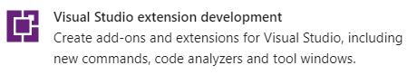
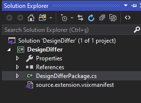
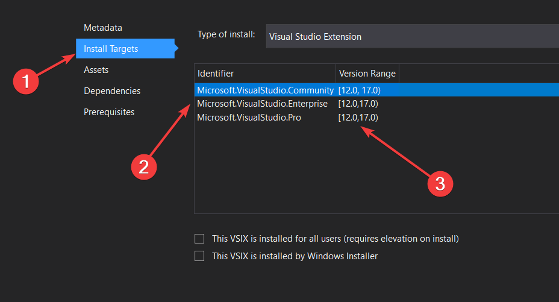
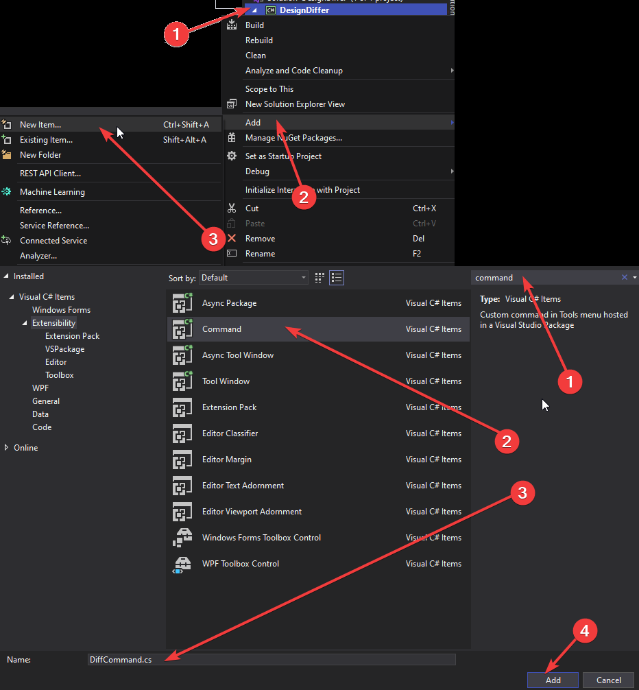
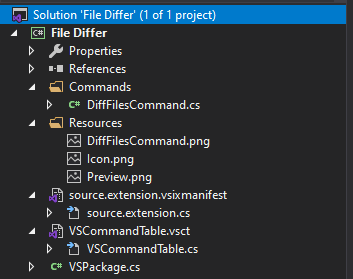
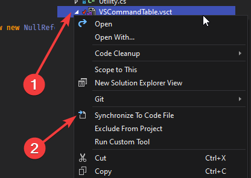
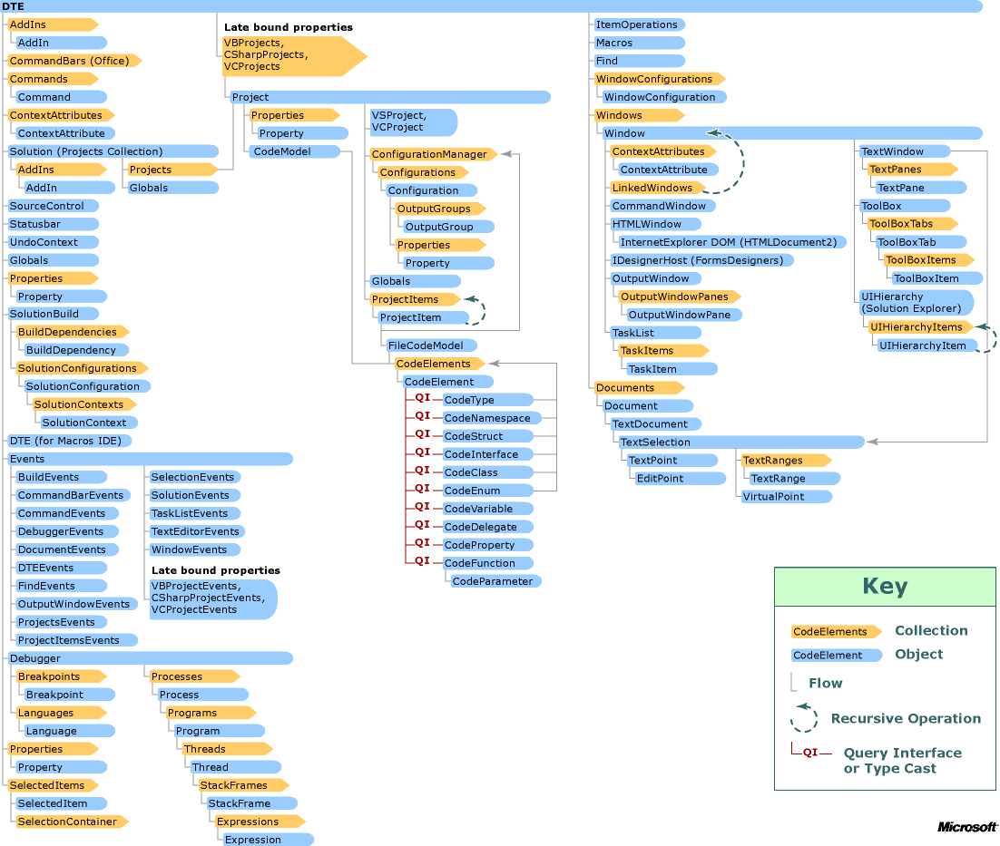

# 🧩 Visual Studio 2019 Eklentisi Programlama

| | |
|-|-|
|👨‍💻 Yapımcı |        🤵 Yunus Emre AK ~ [YEmreAk.com](https://yemreak.com)|
|✨ Son Güncelleme| 📅 10.09.2020 |

## 📋 İçerikler

- [🚴‍♂️ İlk Projeyi Oluşturma](#🚴‍♂️-i̇lk-projeyi-oluşturma)
    - [💎 Ön Gereksinimler](#💎-ön-gereksinimler)
    - [🚩 Çalışma Yolu](#🚩-çalışma-yolu)
    - [🔰 VSIX Yapımına Hazırlanma](#🔰-vsix-yapımına-hazırlanma)
    - [👨‍🔧 Proje İsmi Güncelleme](#👨‍🔧-proje-i̇smi-güncelleme)
    - [📜 Manifest Ayarları](#📜-manifest-ayarları)
    - [🎯 Hedef Uygulamaları ve Sürümleri Değiştirme](#🎯-hedef-uygulamaları-ve-sürümleri-değiştirme)
    - [🖼️ VSIX için ikon ekleme](#🖼️-vsix-için-ikon-ekleme)
    - [🎛️ İlk Komut Butonunu Ekleme](#🎛️-i̇lk-komut-butonunu-ekleme)
- [👨‍💼 Eklenti Yönetimi](#👨‍💼-eklenti-yönetimi)
    - [❔ `.vsct` Dosyası Nedir](#❔-vsct-dosyası-nedir)
    - [🆔 GUID Değerlerini Tanımlama](#🆔-guid-değerlerini-tanımlama)
    - [👨‍💻 Komut Ekleme](#👨‍💻-komut-ekleme)
    - [🔘 Buton Ekleme](#🔘-buton-ekleme)
    - [🔌 Kaynak Koda Bağlama](#🔌-kaynak-koda-bağlama)
- [🍏 IDE Objelerine Erişme](#🍏-ide-objelerine-erişme)
    - [🐥 Visual Studio Ortam Objelerine Erişme](#🐥-visual-studio-ortam-objelerine-erişme)
    - [📁 ProjectItem](#📁-projectitem)
    - [👨‍💻 FileCodeModel](#👨‍💻-filecodemodel)
    - [🍏 CodeElement](#🍏-codeelement)
- [👨‍💻 Kod Örnekleri](#👨‍💻-kod-örnekleri)
    - [📃 Aktif Dökümanın İçeriğini Alma](#📃-aktif-dökümanın-i̇çeriğini-alma)
    - [📝 Editör Üzerindeki Seçili Metni Sıralama](#📝-editör-üzerindeki-seçili-metni-sıralama)
    - [👨‍💻 Editör Üzerindeki Seçili Metnin içerisindeki Method İçeriğini Sıralama](#👨‍💻-editör-üzerindeki-seçili-metnin-içerisindeki-method-i̇çeriğini-sıralama)
    - [📂 Aktif Dokümandaki Üretilen Kodları Sıralama](#📂-aktif-dokümandaki-üretilen-kodları-sıralama)
    - [♊ İki Dosya Arasındaki Farklılıkları Gösterme](#♊-i̇ki-dosya-arasındaki-farklılıkları-gösterme)
    - [🔀 Git Komutu Çalıştırma](#🔀-git-komutu-çalıştırma)
    - [🧵 Proje dizinini ve dosya yolunu alma](#🧵-proje-dizinini-ve-dosya-yolunu-alma)
    - [Git process oluşturma ve okuma](#git-process-oluşturma-ve-okuma)
    - [👨‍💻 Dosyadan FileCodeModel Oluşturma](#👨‍💻-dosyadan-filecodemodel-oluşturma)
    - [Designer Dosyasını Önceki Sürümü ile Sıralanarak Karşılaştırılması](#designer-dosyasını-önceki-sürümü-ile-sıralanarak-karşılaştırılması)
- [VSIX için Dialog Box Oluşturma](#vsix-için-dialog-box-oluşturma)
    - [Bağımlılıkları Tanımlama](#bağımlılıkları-tanımlama)
    - [Dialog penceresini oluşturma](#dialog-penceresini-oluşturma)
    - [OnClick ve OnCompare eylemleri tanımlama](#onclick-ve-oncompare-eylemleri-tanımlama)
    - [OnCompare Butonu Algoritmasını Oluşturma](#oncompare-butonu-algoritmasını-oluşturma)

<div class="page"/>

## 🚴‍♂️ İlk Projeyi Oluşturma

### 💎 Ön Gereksinimler

Eklentiyi Visual Studio için C# ile programlamlayacağımızdan dolayı:

- ⏬ `Visual Studio` ve `Visual Studio extension development` iş yükü indirilmelidir
- 💁‍♂️ Eklenti için derinden bir C# bilgisi yerine hızlı bir öğrenmeye odaklanılması kafidir
- 🏃‍♂️ Hızlıca C# öğrenmek için [CSharp Quick Guide](https://www.tutorialspoint.com/csharp/csharp_quick_guide.htm) sayfasına bakmalısın
- 👮‍♂️ Yazım standartları için [CSharp Coding Standarts](https://www.dofactory.com/reference/csharp-coding-standards) alanına da bakabilirsin

> 📃 C# Hakkında bilgi için [C# Quick Start](./assets/CSharp%20Quick%20Start.pdf) pdf notlarımı da inceleyebilirsin



### 🚩 Çalışma Yolu

- 👨‍💻 Eklenti programlanır, derlenir ve çalıştırılır
- 🐙 GitHub üzerinden versiyon kontrol sistemi ile ilerleme kontrol edilir
- ⚗️ Derlenme ve test işlemleri Continuous Integration (CI) ile otomatikleştirilir
- 📡 Herkese açık stabil bir sürümü üzerinden eklenti yayınlanır
    - 😅 Tabi bu sadece açık kaynak olmasını isterseniz yapılır
- ⏫ VS Gallery üzerine eklenti aktarılır

### 🔰 VSIX Yapımına Hazırlanma

- ☀️ `Create New Project` - `VSIX Project` alanından proje oluşturulur
- 

<div class="page"/>

### 👨‍🔧 Proje İsmi Güncelleme

- 🤔 Proje isminden vazgeçmeniz veya ismini yanlış belirtmeniz durumunda projenin adını güncellemeniz gerekebilir
- 🔨 `Solution Explorer` üzerinden `Properties` alanından güncellenir
- 


### 📜 Manifest Ayarları

- 📃 `*.vsix.manifest` dosyası mafisesto dosyasıdır ve projenin ayarlarını içerir
- 🆔 `Product ID` kısmında `<Projeİsmi>.<GUID>` şeklinde olan değerden `Projeİsmi` silinir
- 🤵 `Author` alanında eklentiyi geliştiren ekibin ve kişinin adı bulunur
- 🏷️ `Version` kısmı [Semantic Versionin](https://semver.org/) tarzı ile uygulama sürüm bilgisini tutar
- 📖 `Description` alanına eklentinin ne işe yaradığına dair bilgi verilir
- 🎫 `Tags` kısmında eklentinin hitap ettiği konulara `<konu>, <konu2>, ...` şeklinde yer verilir, aramalarda bu şekilde çıkar
- 🖼️ `Preview Image` 175x175 ve `Icon` ise 90x90 boyutunda eklentinin ikon resmini barındırır
- 🔐 `License` alanına kendi lisans dosyanızın yolunu eklersiniz (örn. [Apache License 2](https://www.apache.org/licenses/LICENSE-2.0))
- 

<div class="page"/>

### 🎯 Hedef Uygulamaları ve Sürümleri Değiştirme

- 🌇 `Install Targets` alanından hangi sürümler üzerinde kullanabileceğinin tanımlaması yapılır
- 🆔 `Identifier` Visual Studio IDE türünün seçildiği alandır
- 🏷️ `Version Range` ise seçilen türde hangi sürümlere kadar desteklendiğini belirtir
- 📦 `Dependencies` kısmı eklentinin kullandığı veya bağlı olduğu framework veya kütüphanelerin belirtildiği kısımdır
- 🧰 `Prerequisites` ile gereksinimleri ve sürümlerini tanımlarız
- 

> ‍🧙‍♂ Detaylı bilgi için [📃 Visual Studio extensions and version ranges demystified](https://devblogs.microsoft.com/visualstudio/visual-studio-extensions-and-version-ranges-demystified/) alanına bakabilirsin.

<div class="page"/>

### 🖼️ VSIX için ikon ekleme

- 🌟 PNG dışındaki formatları da destekler ama PNG kullan
- 📦 VSIX'de 3000 icon vardır bunları kullanabilmek için [Extensibility Essentials 2019](https://marketplace.visualstudio.com/items?itemName=MadsKristensen.ExtensibilityEssentials2019) eklentisini indir
- ⚙️ View -> Other Windows -> KnownMonikers
    - 
- 📝 Çıkan panelde seçilen ikonu Resource içerisine alttak özelliklerle eklemeliyiz:
  - `16 width` ile  `*Command.png` icon dosyasını overwrite ederek
  - `175 width` ile `Preview` isimle
  - `90 width` ile `Icon` isimle
- 💦 `*.vsct` dosyası içerisinde **silmen gereken** kısımlar
  -  `Bitmap` alanında `usedList` kısmındaki değerlerden ilki hariç diğerlerini
  -  `GuidSymbol` alanındaki `IDSymbol` satırlarından ilki hariç diğerlerini
- ➕ Son eklenen resimleri projeye dahil etmek için `Solution Explorer` alanında  sağdan 3. ikon `Show all files` ile resimleri bulup, onları seçip, sağ tıklayıp `Include From Project` demeliyiz
    - 
- 🔨 `*.vsixmanifest` dosyasına ikon ve ön izleme resmi eklenmeli
    - 

<div class="page"/>

### 🎛️ İlk Komut Butonunu Ekleme

- ➕ `Solution Explorer` üzerinden projeye sağ tıklayıp `Add` -> `New Item`-> `Command` ile ilk komutumuzu ekliyoruz
    - 
- 🗃️ Yukarıdaki işlem ile projeye eklenen dosyalar
    - `<dosya ismi>.cs` ve 
    - `<proje ismi>.vsct` ile butonları ve diğer fonksiyonelliklerin tanımlandığı dosya
    - `Resources` dizini içerisine eklenti ile ilgili görsel objeler
- 🌟 İlerleyen konularda da yöneleceğimiz ve önerilen proje yapısı aşağıdaki gibidir
    - 

## 👨‍💼 Eklenti Yönetimi

### ❔ `.vsct` Dosyası Nedir

- Proje içerisindeki komutlar, resimler ve benzeri her bilişen bilgisi burada saklanır
- Tüm bileşenler birbirlerine ve kaynak kodlara guid değerleri ile bağlanır
- Proje içerisinde tek bir vsct dosyası bulunur

### 🆔 GUID Değerlerini Tanımlama

- Bileşen arasındaki bağlantılar için değişkenleri tanımlayan guid değerleri kullanılır
- Her guid değeri eşsiz olmak zorundadır
- `Symbols` alanı içerisinde ilk başta paket guid değeri tanımlanır
- `GuidSymbol` ile paket içerisindeki belirli guidler için alt değerler `IDSymbol` ile tanımlanır
    - usedList="1" için `IDSymbol` değeri `1` olan `usedList="bmpPic1" aynıdır
    - `*CmdSet` isimli `GuidSymbol` değerleri, komut gruplarını işaretlemek için kullanılır
    - `*Images` olarak tanımlananlar ise resimler işaretlerler
- IDSymbol değeri `CommandId` ile bitenler komutların guid değerlerini temsil eder

<div class="page"/>

```xml
<Symbols>
<!-- Paket bilgisi tutan değişken. -->
<GuidSymbol name="guidDesignDifferPackage" value="{97999930-ccf3-4150-8507-52957afe824c}" />

<!-- Menü komutlarını bir arada tutmak için kullanılan değişkenler. -->
<GuidSymbol name="guidFile_VSPackageCmdSet" value="{020df2a1-db50-4da9-b02d-429321000270}">
    <IDSymbol name="FileContextMenuGroup" value="0x110" />
    <IDSymbol name="EditorContextMenuGroup" value="0x120" />
    <IDSymbol name="DiffFilesCommandId" value="0x0100" />
    <IDSymbol name="CompareHistoryCommandId" value="0x0101" />
    <IDSymbol name="DiffContentCommandId" value="0x0102" />
</GuidSymbol>

<!-- Resimleri bağlamak için kullanılan değişkenler. -->
<GuidSymbol name="guidImages" value="{2a122da1-1d9a-48b8-89ff-ee6527567153}">
    <!-- Birden fazla resim içeren bir dosyadan istenen sıradaki resmi almak için kullanılır -->
    <IDSymbol name="firstImage" value="1" />
    <IDSymbol name="bmpDiff" value="2" />
</GuidSymbol>

<!-- İsteğe bağlı sabit değerler de kullanılabildiğinden değişkensiz resim işaretçisi tanımlanabilir -->
<GuidSymbol name="guidImages1" value="{ed02defe-f3bf-4cf7-913b-9772fffe8e26}"></GuidSymbol>
<GuidSymbol name="guidImages2" value="{1dd321f2-63ba-4bff-aee8-6f6d3995c650}"></GuidSymbol>
</Symbols>
```

<div class="page"/>

### 👨‍💻 Komut Ekleme

- Komutlar `Commands` içeriside `Groups` objeleri içindeki `Group` değerleri ile derlenir
- `Group` içerisindeki `Parent` objelerindaki `id` değeri ile komutun nasıl çalışacağını ifade ederiz
    - `IDM_VS_CTXT_ITEMNODE` ile `Solution Explorer` üzerine sağ tıklandığında çıkan menüye eklenen komutları
    - `IDM_VS_CTXT_CODEWIN` ile editöre sağ tıklandığında çıkan menüdeki komutları
    - [GUIDs and IDs of Visual Studio menus](https://docs.microsoft.com/en-us/visualstudio/extensibility/internals/guids-and-ids-of-visual-studio-menus?view=vs-2019s)
    - [IDE-Defined Commands for Extending Project Systems](https://docs.microsoft.com/en-us/visualstudio/extensibility/internals/ide-defined-commands-for-extending-project-systems?view=vs-2019s)
- `priority` değeri ile grubun bulunacağı konum belirlenir, düşük değerler daha yukarıya alır

```xml
<Groups>
    <Group guid="guidFile_VSPackageCmdSet" id="FileContextMenuGroup" priority="0x0400">
        <Parent guid="guidSHLMainMenu" id="IDM_VS_CTXT_ITEMNODE" />
    </Group>
    <Group guid="guidFile_VSPackageCmdSet" id="EditorContextMenuGroup" priority="0x0300">
        <Parent guid="guidSHLMainMenu" id="IDM_VS_CTXT_CODEWIN" />
    </Group>
</Groups>
```

### 🔘 Buton Ekleme

- Butonlar `Buttons` alanına `GUID` değer ile eklenir
- Buton guid değeri paket guid değeri ile aynı olur
- `priority` değeri ile butonun bulunacağı konum belirlenir, düşük değerler daha yukarıya alır
- Parent alanı ile bağlı olduğu komut butonu guid değeri verilir
    - Bu sayede grup üzerindeki komutların davranışlarına uygun konumlanır
    - `IDM_VS_CTXT_ITEMNODE` id değerine sahip komut grubu için `Solution Explorer` üzerine sağ tıklandığında çıkan menüye ekleinir
- Icon alanı ile butonun sağında olan ikon guid ile belirlenir
    - `guid` ile ikon dosyasına `id` ile kaçıncı resmi almak istediğimizi belirtiriz
    - Resim indeksleri `0`'dan değil `1`'den başlar
    - İkonları tutmak için `Bitmaps` alnında guid değerli `Bitmap` objeleri kullanılır
    - `href` alanı temsil ettiği resim objenin yolunu tutar
    - `usedList` ile birden fazla resim içeren objelerden, hangi resimlerin alınacağını söyleriz
    - `usedList="1"` ile ilk resmi, `usedList="1, 2, 3"` ile ilk 3 resmi projeye dahil ederiz
- `Strings` alanında `ButtonText` ise butondaki metni temsil eder

<div class="page"/>

```xml
<Buttons>
    <Button guid="guidFile_VSPackageCmdSet" id="DiffFilesCommandId" priority="0x0100" type="Button">
        <Parent guid="guidFile_VSPackageCmdSet" id="FileContextMenuGroup" />
        <Icon guid="guidImages" id="1" />
        <Strings>
            <ButtonText>Compare with file...</ButtonText>
        </Strings>
    </Button>
    <Button guid="guidFile_VSPackageCmdSet" id="CompareHistoryCommandId" priority="0x0100" type="Button">
        <Parent guid="guidFile_VSPackageCmdSet" id="FileContextMenuGroup" />
        <Icon guid="guidImages1" id="1" />
        <Strings>
            <ButtonText>Compare designer file with history...</ButtonText>
        </Strings>
    </Button>
    <Button guid="guidFile_VSPackageCmdSet" id="DiffContentCommandId" priority="0x0100" type="Button">
        <Parent guid="guidFile_VSPackageCmdSet" id="EditorContextMenuGroup" />
        <Icon guid="guidImages2" id="1" />
        <Strings>
            <ButtonText>Sort Windows Form Designer Generated Code</ButtonText>
        </Strings>
    </Button>
</Buttons>

<!-- guidImages değişkeninin GuidSymbol olarak tanımlanmış olmaları gerekmektedir -->
<Bitmaps>
    <Bitmap guid="guidImages" href="Resources\DiffFilesCommand.png" usedList="1" />
    <Bitmap guid="guidImages1" href="Resources\CompareHistoryCommand.png" usedList="1" />
    <Bitmap guid="guidImages2" href="Resources\DiffContentCommand.png" usedList="1" />
</Bitmaps>
```

<div class="page"/>

### 🔌 Kaynak Koda Bağlama

- Komutların tetiklenmesi durumunda yapılacak eylemler kaynak kod tarafında `Execute` metodu içerisinde belirlenir
- Kaynak koda komutu bağlamak için `CommandSet` ve o küme içerisindeki `CommandId` değeri gerekir
    - `CommandSet`, `vsct` dosyası içerisinde `*CmdSet` olarak adlandırılan guid değerini alır
    - `CommandId` yukarıdaki guid içerisindeki hedeflenen komutun `IDSymbol` değerlerini alır
- Bu işlemi senkronize etmek ve her guid değişikliğinde güncellemekten kurtulmak için
    - `vsct` dosyasına sağ tıklayın ve `Syncronize code file` butonuna tıklayın
    - `PackageGuids` ve `PackageIds` içeren C# `class` objeleri otomatik olarak tanımlacaktır  
    -  

```c#
namespace DesignerDiffer
{
    /// <summary>
    /// Command handler
    /// </summary>
    internal sealed class DiffContentCommand
    {
        /// <summary>
        /// Command ID.
        /// </summary>
        public const int CommandId = PackageIds.DiffContentCommandId;

        /// <summary>
        /// Command menu group (command set GUID).
        /// </summary>
        public static readonly Guid CommandSet = PackageGuids.guidFile_VSPackageCmdSet;

        /// <summary>
        /// VS Package that provides this command, not null.
        /// </summary>
        private readonly AsyncPackage package;

        // ...
    }
}
```

## 🍏 IDE Objelerine Erişme

### 🐥 Visual Studio Ortam Objelerine Erişme

- 💠 IDE objelerine erişmek için `EnvDT80.DTE2` objesi kullanılır
- 🍎 `await <asyncServiceProvider>.GetServiceAsync(typeof(DTE)).ConfigureAwait(false) as DTE2` kodu ile DTE objesi alınır
- 📂 `dte2.ItemOperations` kodu ile dosya açma, ekleme ve benzeri işlemler IDE ile otomatikleştirilebilir

| Kod | Açıklama|
| -   | -        |
| `dte2.ActiveDocument` | IDE üzerinde aktif olan doküman |
| `dte2.ActiveDocument.ProjectItem` | Aktif dokümanın proje objesi (kaynak kodlara vb erişim)
| `dte2.ToolWindows.SolutionExplorer.SelectedItems` | Solution Explorer üzerindeki seçilen dosyalara erişiriz|
| `dte2.ExecuteCommand("<komut>", "<argümanlar>")` | Command Window üzerinde komut çalıştırır |
| `dte2.ItemOperations.AddExistingItem(<filepath>)` | Projeye var olan dosyayı ekler ve yolun -proje dizininde olduğundan-  günceller |
| `dte2.ItemOperations.OpenFile(<filepath>)` | IDE ile dosyayı açar, projeye dahil etmem, kaynak kod derlenmez (FileCodeModel olmaz) |




<div class="page"/>

### 📁 ProjectItem

- 💡 Solution içerisinde yer alan ve derlenen proje dosyasını tutan objedir
- 🤖 Dosya üzerindeki otomasyon işlemleri bu obje ile yapılır
- 📂 Dosya işlemleri `<projectItem>.Delete()`, `<projectItem>.Save()`, `<projectItem>.Remove()` gibi işlemler buradan yapılır
- 👨‍💻 Dosya içerisindeki kaynak kod modeline `<projectItem>.FileCodeModel` şeklinde erişebiliriz

```c#
ProjectItem selectedProjectItem = dte2.ItemOperations.AddExistingItem(filePath);
FileCodeModel selectedFileCodeModel = selectedProjectItem.FileCodeModel;
```

### 👨‍💻 FileCodeModel

- 💡 IDE üzerinde derlenen (build) proje dosyaları (ProjectItem) kaynak kodlarını tutan modeldir
- 🍏 `CodeElements` olan kod elemanlarını tutan objelerden oluşur
- 🍎 `CodeNamespace`, `CodeElement`, `CodeClass`, `CodeFunction` gibi kaynak kod özelliğine göre obje içerir
- 👨‍💻 `<codeNamespace | codeClass >.Children` komutu ile namespace veya class içerisindeki kaynak kod objelerine erişilir

> 📢 Derlenmemiş dosyalarda - yani projeye dahil olmayan harici dosyalar olan `Miscellaneous` dosyalarında - FileCodeModel olmaz

<div class="page"/>

```c#
public static bool IsFuncExistInCodeElements(CodeElements codeElements, string name, out CodeFunction cf)
{
    ThreadHelper.ThrowIfNotOnUIThread();
    foreach (CodeElement element in codeElements)
    {
        if (element is CodeNamespace)
        {
            CodeNamespace nsp = element as CodeNamespace;

            foreach (CodeElement subElement in nsp.Children)
            {
                if (subElement is CodeClass)
                {
                    CodeClass c2 = subElement as CodeClass;
                    foreach (CodeElement item in c2.Children)
                    {
                        if (item is CodeFunction)
                        {
                            CodeFunction _cf = item as CodeFunction;
                            if (_cf.Name == name)
                            {
                                cf = _cf;
                                return true;
                            }
                        }
                    }
                }
            }
        }
    }
    cf = null;
    return false;
}
```

<div class="page"/>

### 🍏 CodeElement

- 🐥 CodeElement objelerinin metinlerine `<codeElement>.GetStartPoint(vsCMPart.vsCMPartBody).CreateEditPoint()` şeklinde erişilir
- 📌 `GetStartPoint(<vsCMPart>)` ile enum değerleri olarak tanımlanan alanların başlangıc konumu alınır
- 🔤 `CreateEditPoint` ile konum bilgisinden içerik metnine erişilir
- İçerik metni üzerinden `GetText(<point>)`, `ReplaceText(<point>)` gibi komutlar metni değiştirebiliriz
- 📝 Obje sonuna kadar almak veya değiştirmek için `<codeElement>.EndPoint` değeri kullanılır

```c#
public static bool IsFuncExistInCodeElements(CodeElements codeElements, string name, out CodeFunction cf) 
{
    string functionBodyText = cf.GetStartPoint(vsCMPart.vsCMPartBody).CreateEditPoint().GetText(cf.EndPoint);
    funcitonBodyText = "Test";
    cf.GetStartPoint(vsCMPart.vsCMPartBody).CreateEditPoint().ReplaceText(cf.EndPoint, funcitonBodyText, (int)vsEPReplaceTextOptions.vsEPReplaceTextAutoformat);
}
```

<div class="page"/>

## 👨‍💻 Kod Örnekleri

### 📃 Aktif Dökümanın İçeriğini Alma

```c#
protected DTE2 dte;
dte2 = (EnvDTE80.DTE2)GetService(typeof(EnvDTE.DTE));

public string GetCurrentTextFile(){

  TextDocument doc = (TextDocument)(dte.ActiveDocument.Object("TextDocument"));
  var p = doc.StartPoint.CreateEditPoint();
  string s = p.GetText(doc.EndPoint);

  return s;            
}
```

> [👪 In VisualStudio DTE, how to get the contents of the ActiveDocument?](https://stackoverflow.com/questions/10606274/in-visualstudio-dte-how-to-get-the-contents-of-the-activedocument)

### 📝 Editör Üzerindeki Seçili Metni Sıralama

```c#
using EnvDTE80;

var dte = await ServiceProvider.GetServiceAsync(typeof(DTE)).ConfigureAwait(false) as DTE2 ?? throw new NullReferenceException("DTE alınamadı");
EnvDTE.TextSelection ts = dte.ActiveWindow.Selection as EnvDTE.TextSelection;
if (ts == null)
    return;

string[] selectedLines = ts.Text.Split('\n');
selectedLines = selectedLines.OrderBy(p => p).ToArray();
ts.Text = string.Join("\n", selectedLines);
```
> - [How to get selected text of visual studio 2015 editor windows?](https://stackoverflow.com/a/40508224)
> - [Read a text file and sort in C#](https://gist.github.com/Ellyll/7716439)

<div class="page"/>

### 👨‍💻 Editör Üzerindeki Seçili Metnin içerisindeki Method İçeriğini Sıralama

```c#
using EnvDTE80;

var dte = await ServiceProvider.GetServiceAsync(typeof(DTE)).ConfigureAwait(false) as DTE2 ?? throw new NullReferenceException("DTE alınamadı");

EnvDTE.TextSelection ts = dte.ActiveWindow.Selection as EnvDTE.TextSelection;
if (ts == null)
    return;
EnvDTE.CodeFunction func = ts.ActivePoint.CodeElement[vsCMElement.vsCMElementFunction] as EnvDTE.CodeFunction;
if (func == null)
    return;

// Func içerğini al -> sırala -> güncelle
string selectedCodeText = func.GetStartPoint(vsCMPart.vsCMPartBody).CreateEditPoint().GetText(func.EndPoint);
selectedCodeText = string.Join("\n", selectedCodeText.Split('\n').OrderBy(p => p));
func.GetStartPoint(vsCMPart.vsCMPartBody).CreateEditPoint().ReplaceText(func.EndPoint, selectedCodeText, (int) vsEPReplaceTextOptions.vsEPReplaceTextAutoformat);
```

> - [vs2010 automation : Get the text value of a EnvDTE.CodeElement](https://stackoverflow.com/a/21463351)
> - [Get function body programatically using Automation](https://social.msdn.microsoft.com/Forums/en-US/542a3756-6d6e-4744-a035-fc7238203857/get-function-body-programatically-using-automation?forum=vsxs)

<div class="page"/>

### 📂 Aktif Dokümandaki Üretilen Kodları Sıralama

```c#
using EnvDTE80;

private async void Execute(object sender, EventArgs e) {
    DTE2 dte = await Utility.GetDTE2Async(ServiceProvider);
    ProjectItem tempProjectItem = dte2.ItemOperations.AddExistingItem(tempFilePath);
    if (Utility.SortFunctionBodyIfExist(tempProjectItem.FileCodeModel, Utility.GeneratedFunctionName))
    {
        tempProjectItem.Save();
        string oldFilePath = filePath.Replace(selectedProjectItem.Name, tempProjectItem.Name);
        Utility.DiffFiles(dte2, oldFilePath, filePath);
    }
}

public static async Task<DTE2> GetDTE2Async(IAsyncServiceProvider asyncServiceProvider) => await asyncServiceProvider.GetServiceAsync(typeof(DTE)).ConfigureAwait(false) as DTE2 ?? throw new NullReferenceException("DTE alınamadı");

public static bool SortFunctionBodyIfExist(FileCodeModel fcm, string funcName)
{
    ThreadHelper.ThrowIfNotOnUIThread();
    if (IsFuncExistInFileCodeModel(fcm, funcName, out CodeFunction cf))
    {
        SortFunctionBody(cf);
        return true;
    }
    return false;
}

public static bool IsFuncExistInFileCodeModel(FileCodeModel fcm, string name, out CodeFunction cf)
{
    ThreadHelper.ThrowIfNotOnUIThread();
    return IsFuncExistInCodeElements(fcm.CodeElements, name, out cf);
}

public static void SortFunctionBody(CodeFunction cf)
{
    ThreadHelper.ThrowIfNotOnUIThread();
    string generatedCode = GetFunctionBodyText(cf);
    generatedCode = StripComments(generatedCode);
    generatedCode = SortContentBy(generatedCode, '\n');
    ReplaceFunctionBodyText(generatedCode, cf);
}

public static bool IsFuncExistInCodeElements(CodeElements codeElements, string name, out CodeFunction cf)
{
    ThreadHelper.ThrowIfNotOnUIThread();
    foreach (CodeElement element in codeElements)
    {
        if (element is CodeNamespace)
        {
            CodeNamespace nsp = element as CodeNamespace;

            foreach (CodeElement subElement in nsp.Children)
            {
                if (subElement is CodeClass)
                {
                    CodeClass c2 = subElement as CodeClass;
                    foreach (CodeElement item in c2.Children)
                    {
                        if (item is CodeFunction)
                        {
                            CodeFunction _cf = item as CodeFunction;
                            if (_cf.Name == name)
                            {
                                cf = _cf;
                                return true;
                            }
                        }
                    }
                }
            }
        }
    }
    cf = null;
    return false;
}
```

> [Get current source file methods in Visual Studio Text Editor Extension](https://stackoverflow.com/a/45181583)

### ♊ İki Dosya Arasındaki Farklılıkları Gösterme

- Dosyayı geçici dizine aynı uzantı ve ismle kayıt ediyoruz
- Ardından `Tool.DiffFiles` komutu ile geçici dizindeki ile orjinal dosyayı karşılaştırıyoruz

```c#
string[] splitFilepath = filepath.Split('\\');
string bareFilename = splitFilepath[splitFilepath.Length - 1];
string tempFilepath = System.IO.Path.GetTempPath() + bareFilename;
System.IO.File.WriteAllText(tempFilepath, fileContent, System.Text.Encoding.UTF8);
dte2.ExecuteCommand("Tools.DiffFiles", $"\"{tempFilepath}\" \"{filepath}\"");
```

<div class="page"/>

### 🔀 Git Komutu Çalıştırma

### 🧵 Proje dizinini ve dosya yolunu alma

```c#
string filepath = "...";
string solutionDir = System.IO.Path.GetDirectoryName(dte2.Solution.FullName);
filepath = filepath.Replace($"{solutionDir}\\", "").Replace("\\", "/");
```

> [👪 How do you get the current solution directory from a VSPackage?](https://stackoverflow.com/a/2338796s)

### Git process oluşturma ve okuma

- `arguments` alanına 

```c#
static System.Diagnostics.Process GitProcess(string arguments, string workdir)
{
    return new System.Diagnostics.Process
    {
        StartInfo = {
            FileName = "git.exe",
            WorkingDirectory = workdir,
            Arguments = $"--no-pager {arguments}",
            RedirectStandardOutput = true,
            UseShellExecute = false,
            CreateNoWindow = true
        },
        EnableRaisingEvents = true
    };
}
```

```c#
string fileContent = "";
gitProcess.Start();
while (!gitProcess.StandardOutput.EndOfStream)
{
    string line = gitProcess.StandardOutput.ReadLine();
    fileContent += line + "\n";
}
```

> - [Process.start: how to get the output?](https://stackoverflow.com/a/4291965)
> - [Is there any async equivalent of Process.Start?](https://stackoverflow.com/a/10789196s)

<div class="page"/>

### 👨‍💻 Dosyadan FileCodeModel Oluşturma

- 💡 Öncelikle stack overflow üzerindeki cevabım [buradadır](https://stackoverflow.com/a/63694341/9770490)
- 👮‍♂️ Visual Studio içerisinde açılan proje dosyalarının `FileCodeModel` objesine erişilebilir
- 🗃️ `dte.ItemOperations.OpenFile` ile açılan dosyalar, `Miscellaneous` olarak gözükür, `ProjectItem` değildir
- 📂 Dosyayı `ProjectItem` olarak açmak için `dte.ItemOperations.AddExistingItem(filePath);` kodu kullanılır
- 👨‍💻 Eklenen dosyanın `FileCodeModel` içeriğine `projectItem.FileCodeModel` şeklinde erişiriz
- İsteğe bağlı olarak` ProjectItem.Delete()` ile eklenen dosya kaldırılabilir

```c#
using EnvDTE;

public static async Task<DTE2> GetDTE2Async(IAsyncServiceProvider asyncServiceProvider) => await asyncServiceProvider.GetServiceAsync(typeof(DTE)).ConfigureAwait(false) as DTE2 ?? throw new NullReferenceException("DTE alınamadı");

string filepath = "TODO";
DTE2 dte2 = await Utility.GetDTE2Async(asyncServiceProvider);
ProjectItem projectItem = dte2.ItemOperations.AddExistingItem(filepath);
FileCodeModel fcm = projectItem.FileCodeModel;
projectItem.Delete();
```

> - [How do I programmatically add a file to a Solution?](https://stackoverflow.com/a/11934026/9770490s)
> - [FileCodeModel null for file in "Misc Files" project. ~ Windows Tech](http://www.windows-tech.info/4/004ffb867c3564c0.php)
> - [FileCodeModel null for file in "Misc Files" project. ~ Microsoft](https://social.msdn.microsoft.com/Forums/sqlserver/en-US/925a2ba3-728b-4bfd-8802-091ef258eace/filecodemodel-null-for-file-in-misc-files-project?forum=vsx)

### Designer Dosyasını Önceki Sürümü ile Sıralanarak Karşılaştırılması

- `Form.Designer.cs` dosyasına sağ tıklayın `Compare with History...` butonunu seçin
- Çıkan form üzerinden istenen branch ve commit hash ile eski sürümü ile kıyaslamayı yapılandırın
- Dosyanın bir önceki sürümü `%TEMP%` dizininde `~<filename>` adıyla oluşturulur
    - `%TEMP%` dizini işletim sistemi otomatik olarak temizlenen bir dizindir
- Oluşturulan geçici dosya aktif projeye dahil edilir ve windows form tarafından üretilen kodlar sıralanır, kaydedilir
- Seçilen dosya içeriğindeki windows form tarafından üretilen kodlar sıralanır, kaydedilmez
- Dosyalar Visual Studio 2019 Tools aracı olan DiffFiles ile karşılaştırılır

<div class="page"/>

## VSIX için Dialog Box Oluşturma


### Bağımlılıkları Tanımlama

- `Add references` alanından gerekli bağımlılıkları ekliyoruz
    - PresentationCore
    - PresentationFramework
    - WindowsBase
    - System.Xaml

> - [Create a dialog box derived from DialogWindow](https://docs.microsoft.com/en-us/visualstudio/extensibility/creating-and-managing-modal-dialog-boxes?view=vs-2019&redirectedfrom=MSDN#create-a-dialog-box-derived-from-dialogwindows)

### Dialog penceresini oluşturma

- `Add new folder` ile `Dialogs` adı altında dizin açın
- Dizine sağ tıklayıp `Add` - `New İtem` - `User Control (WPF)` ile `xaml` ve `xaml.cs` dosyaları oluşturuyoruz
- `*.xaml.cs` dosyasındaki `UserControl` -> `DialogWindow` olarak güncellenecek
- `*.xaml` dosyasına aşağıdaki değişiklikler yapılmıştır
    - `xmlns:platformUi="clr-namespace:Microsoft.VisualStudio.PlatformUI;assembly=Microsoft.VisualStudio.Shell.15.0"` (15 değeri güncel sürümlerde değişebilir)
    - `platformUi:DialogWindow`
    - `WindowStartupLocation="CenterScreen" Width="500" Height="200"`

<div class="page"/>

```xml
<platformUi:DialogWindow x:Class="<NAMESPACE>.<CLASS_NAME>"
             xmlns="http://schemas.microsoft.com/winfx/2006/xaml/presentation"
             xmlns:x="http://schemas.microsoft.com/winfx/2006/xaml"
             xmlns:mc="http://schemas.openxmlformats.org/markup-compatibility/2006" 
             xmlns:d="http://schemas.microsoft.com/expression/blend/2008" 
             xmlns:platformUi="clr-namespace:Microsoft.VisualStudio.PlatformUI;assembly=Microsoft.VisualStudio.Shell.15.0"
             mc:Ignorable="d" 
             WindowStartupLocation="CenterScreen"
             Width="500" Height="200">
    
    <!--Title="Örnek amaçlı GUI"-->
    <Border Margin="5" >
        <Grid>
            <Grid.RowDefinitions>
                <RowDefinition Height="
"/>
                <RowDefinition Height="
"/>
                <RowDefinition Height="
"/>
                <RowDefinition Height="*"/>
                <RowDefinition Height="
"/>
            </Grid.RowDefinitions>
            <TextBlock Text="Compare with the given branch: " Margin="5"/>
            <TextBox Grid.Row="1" x:Name="SelectionTextBox" Margin="5" MaxHeight="100" 
                     ScrollViewer.VerticalScrollBarVisibility="
"
                     />
            <TextBlock Grid.Row="2" Margin="5">Commit hash:</TextBlock>
            <TextBox Grid.Row="3" x:Name="DocumentationTextBox"
                     AcceptsReturn="True" TextWrapping="Wrap" HorizontalAlignment="Stretch" Margin="5"
                     ScrollViewer.VerticalScrollBarVisibility="
"/>
            <StackPanel Orientation="Horizontal" HorizontalAlignment="Right" Grid.Row="4">
                <Button Margin="5" Padding="5" Click="OnCompare">Save</Button>
                <Button Margin="5" Padding="5" Click="OnCancel">Cancel</Button>
            </StackPanel>
        </Grid>
    </Border>
</platformUi:DialogWindow>
```

- Code tarafında aşağıdaki method ile diyalog penceresini gösteriyoruz

<div class="page"/>

```c#
private void ShowCompareWithHistoryWindow()
{
    var compareFileWithHistoryDialog = new CompareWithHistoryDialog("Microsoft.VisualStudio.PlatformUI.DialogWindow")
    {
        HasMinimizeButton = false,
        HasMaximizeButton = false
    };
    compareFileWithHistoryDialog.ShowDialog();
}
```

> - [Options for displaying modal dialogs in Visual Studio extensions](https://www.visualstudiogeeks.com/extensibility/visual%20studio/options-for-displaying-modal-dialogs-in-visual-studio-extensions#use-vs-sdk)
> - [Options for displaying modal dialogs in Visual Studio extensions - GitHub Changes](https://github.com/onlyutkarsh/XamlDialogInVSExtensionDemo/commit/616a945e3399e4869c6cd4ef28cb5b377495559b)
> - [Part 4: Show a popup Window](https://michaelscodingspot.com/visual-studio-2017-extension-development-tutorial-part-4-show-a-popup-window/)
> - [Part 4: Show a popup Window - Github Source Code](https://github.com/michaelscodingspot/CodyDocs/tree/Part4/CodyDocs)

### OnClick ve OnCompare eylemleri tanımlama

- `xaml` dosyası içerisinde aşağıdaki gibi tanımlanan butonlar için kaynak kod örneği verilmiştir

```xml
<Button Margin="5" Padding="5" Click="OnCompare">Save</Button>
<Button Margin="5" Padding="5" Click="OnCancel">Cancel</Button>
```

```c#
public partial class <CLASS_NAME> : DialogWindow
{
    public <CLASS_NAME>(string helpTopic) : base(helpTopic)
    {
        InitializeComponent();
    }

    private void OnCancel(object sender, RoutedEventArgs e)
    {
        this.Close();
    }

    private void OnCompare(object sender, RoutedEventArgs e)
    {
        MessageBox.Show("Save"); // TODO
    }
}
```

> - [Part 4: Show a popup Window](https://michaelscodingspot.com/visual-studio-2017-extension-development-tutorial-part-4-show-a-popup-window/)

<div class="page"/>

### OnCompare Butonu Algoritmasını Oluşturma

```c#
private async void OnCompare(object sender, RoutedEventArgs e)
{

    string branch = this.BranchTextBox.Text.Trim();
    string commitHash = this.CommitHashTextBox.Text.Trim();

    if (branch == "")
    {
        MessageBox.Show("Gerekli alanlar doldurulmadığı için HEAD ile kıyaslanacak");
        branch = "HEAD";
    }

    var dte2 = await GetDTE2Async(asyncServiceProvider);

    await ThreadHelper.JoinableTaskFactory.SwitchToMainThreadAsync();
    if (CanFileBeCompared(dte2, out string filePath))
    {
        string solutionDir = System.IO.Path.GetDirectoryName(dte2.Solution.FullName);
        string fileContent = GetFileHistoryContent(solutionDir, filePath, branch, commitHash);
        string tempFilePath = CopyContentToTemp(filePath, fileContent);

        ProjectItem selectedProjectItem = dte2.ItemOperations.AddExistingItem(filePath);
        FileCodeModel selectedFileCodeModel = selectedProjectItem.FileCodeModel;
        if (selectedFileCodeModel != null)
        {
            if (SortFunctionBodyIfExist(selectedFileCodeModel, Utility.GeneratedFunctionName))
            {
                ProjectItem tempProjectItem = dte2.ItemOperations.AddExistingItem(tempFilePath);
                if (SortFunctionBodyIfExist(tempProjectItem.FileCodeModel, Utility.GeneratedFunctionName))
                {
                    tempProjectItem.Save();
                    string oldFilePath = filePath.Replace(selectedProjectItem.Name, tempProjectItem.Name);
                    DiffFiles(dte2, oldFilePath, filePath);
                }
                else
                {
                    MessageBox.Show("Seçili dosyanın belirtilen commit hash için kaydı git ile bulunamadı");
                }
                tempProjectItem.Delete();
            }
            else
            {
                MessageBox.Show("Seçili dosya designer dosyası değil");
            }
        }
        else
        {
            MessageBox.Show("Dosya içeriği desteklenmiyor");
        }
    }
    this.Close();
}

public static bool CanFileBeCompared(DTE2 dte, out string filepath)
{
    ThreadHelper.ThrowIfNotOnUIThread();

    filepath = GetSelectedFiles(dte).ElementAtOrDefault(0);
    return !string.IsNullOrEmpty(filepath);
}

/// <summary>
/// Dosya yollarının bilgilerini verir
/// </summary>
/// <param name="dte">VS için otomasyon objesi</param>
/// <returns></returns>
public static IEnumerable<string> GetSelectedFiles(DTE2 dte)
{
    ThreadHelper.ThrowIfNotOnUIThread();
    var items = (Array)dte.ToolWindows.SolutionExplorer.SelectedItems;
    return from item in items.Cast<UIHierarchyItem>()
            let pi = item.Object as ProjectItem
            select pi.FileNames[1];
}

public static string GetFileHistoryContent(string repo, string filepath, string branch, string commitHash)
{
    string relatedFilePath = filepath.Replace($"{repo}\\", "").Replace("\\", "/");

    string fileContent = "";
    var gitProcess = GitProcess($"show {branch}{commitHash}:{relatedFilePath}", repo);
    gitProcess.Start();
    while (!gitProcess.StandardOutput.EndOfStream)
    {
        string line = gitProcess.StandardOutput.ReadLine();
        fileContent += line + "\n";
    }

    return fileContent;
}

public static System.Diagnostics.Process GitProcess(string arguments, string workdir) => new System.Diagnostics.Process
{
    StartInfo = {
            FileName = "git.exe",
            WorkingDirectory = workdir,
            Arguments = $"--no-pager {arguments}",
            RedirectStandardOutput = true,
            UseShellExecute = false,
            CreateNoWindow = true
        },
    EnableRaisingEvents = true
};

public static string CopyContentToTemp(string filepath, string fileContent)
{
    string tempFilepath = System.IO.Path.GetTempPath() + "~" + filepath.Split('\\').Last();
    System.IO.File.WriteAllText(tempFilepath, fileContent, Encoding.UTF8);
    return tempFilepath;
}

public static bool SortFunctionBodyIfExist(FileCodeModel fcm, string funcName)
{
    ThreadHelper.ThrowIfNotOnUIThread();
    if (IsFuncExistInFileCodeModel(fcm, funcName, out CodeFunction cf))
    {
        SortFunctionBody(cf);
        return true;
    }
    return false;
}

public static bool IsFuncExistInFileCodeModel(FileCodeModel fcm, string name, out CodeFunction cf)
{
    ThreadHelper.ThrowIfNotOnUIThread();
    return IsFuncExistInCodeElements(fcm.CodeElements, name, out cf);
}

public static bool IsFuncExistInCodeElements(CodeElements codeElements, string name, out CodeFunction cf)
{
    ThreadHelper.ThrowIfNotOnUIThread();
    foreach (CodeElement element in codeElements)
    {
        if (element is CodeNamespace)
        {
            CodeNamespace nsp = element as CodeNamespace;

            foreach (CodeElement subElement in nsp.Children)
            {
                if (subElement is CodeClass)
                {
                    CodeClass c2 = subElement as CodeClass;
                    foreach (CodeElement item in c2.Children)
                    {
                        if (item is CodeFunction)
                        {
                            CodeFunction _cf = item as CodeFunction;
                            if (_cf.Name == name)
                            {
                                cf = _cf;
                                return true;
                            }
                        }
                    }
                }
            }
        }
    }
    cf = null;
    return false;
}

public static void SortFunctionBody(CodeFunction cf)
{
    ThreadHelper.ThrowIfNotOnUIThread();
    string generatedCode = GetFunctionBodyText(cf);
    generatedCode = StripComments(generatedCode);
    generatedCode = SortContentBy(generatedCode, '\n');
    ReplaceFunctionBodyText(generatedCode, cf);
}

public static void DiffFiles(DTE2 dte2, string filepath1, string filepath2)
{
    dte2.ExecuteCommand("Tools.DiffFiles", $"\"{filepath1}\" \"{filepath2}\"");
}
```
