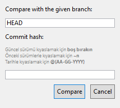

# 17. Gün ve Sonrası

Dokümantasyon işlemleri ve kodlarda kontroller yapılacak

- Enter'a basılınca Compare, ESC'ye basınca cancel butonu tetiklenmekte
    - Sırasıyla IsDefault="True" IsCancel="True"
- Commit hash için detaylar diyalog formuna eklendi
- Hata olması durumunda formun kapatılması iptal edildi
- Commit hash alanı için enter algılama özelliği kaldırıldı
    - AcceptsReturn="True" ve  ScrollViewer.VerticalScrollBarVisibility="Auto" kaldırıldı
- Diyalog açıldığı anda Commit Hast alanına metin girilebilir hale getirildi
    - CommitHashTextBox.Focus();
    - https://docs.microsoft.com/en-us/dotnet/desktop/wpf/controls/how-to-set-focus-in-a-textbox-control?view=netframeworkdesktop-4.8

