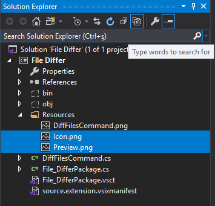

# Geliştirmeler | VSIX

## 🖼️ VSIX için ikon ekleme

- 🌟 PNG dışındaki formatları da destekler ama PNG kullan
- 📦 VSIX'de 3000 icon vardır bunları kullanabilmek için [Extensibility Essentials 2019](https://marketplace.visualstudio.com/items?itemName=MadsKristensen.ExtensibilityEssentials2019) eklentisini indir
- ⚙️ View -> Other Windows -> KnownMonikers
    - 
- 📝 Çıkan panelde seçilen ikonu Resource içerisine alttak özelliklerle eklemeliyiz:
  - `16 width` ile  `*Command.png` icon dosyasını overwrite ederek
  - `175 width` ile `Preview` isimle
  - `90 width` ile `Icon` isimle
- 💦 `*.vsct` dosyası içerisinde **silmen gereken** kısımlar
  -  `Bitmap` alanında `usedList` kısmındaki değerlerden ilki hariç diğerlerini
  -  `GuidSymbol` alanındaki `IDSymbol` satırlarından ilki hariç diğerlerini
- ➕ Son eklenen resimleri projeye dahil etmek için `Solution Explorer` alanında  sağdan 3. ikon `Show all files` ile resimleri bulup, onları seçip `Include From Project` demeliyiz
    - 
- 🔨 ``*.vsixmanifest` dosyasına ikon ve ön izleme resmi eklenmeli
    - 

### 🏗️ VSIX Eklentisi Proje Yapısı

- `vcst` ve `vsixmanifest` dosyası `sync` edilmeli

## 👨‍🔧 Proje İsmi Güncelleme

- `Solution Explorer` üzerinden `Properties` alanından güncellenir

